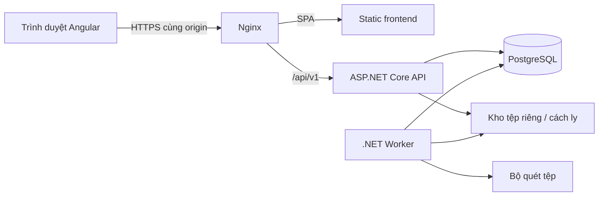
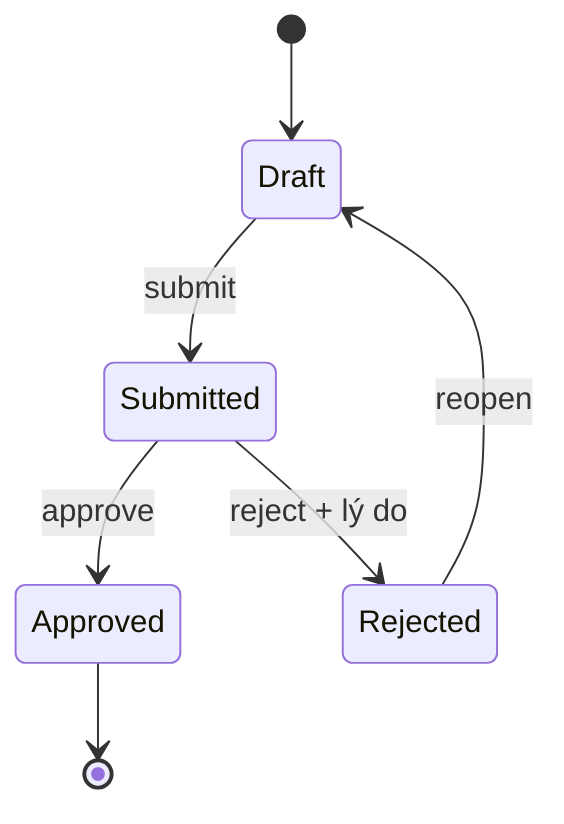
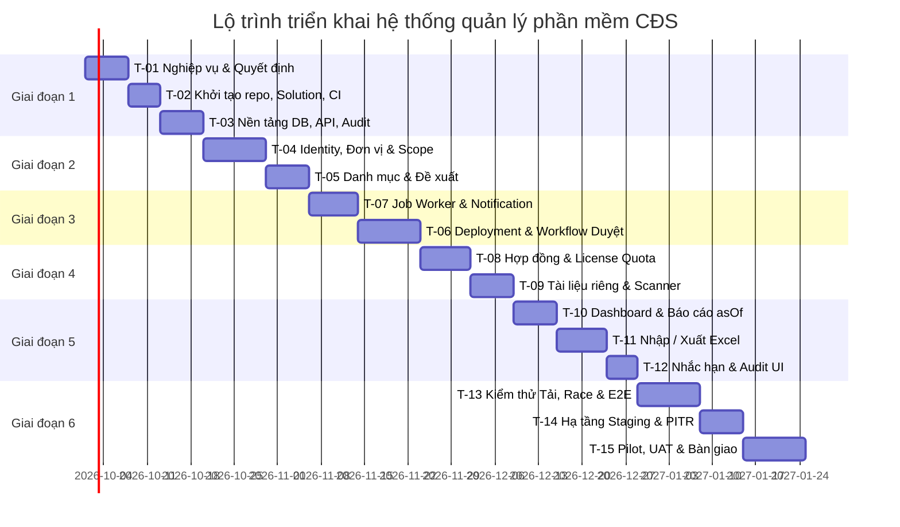

# SPEC — Hệ thống quản lý phần mềm chuyển đổi số tại Lào Cai

> Phiên bản: 1.0 | Ngày lập: 18/09/2026 | Trạng thái: đặc tả đề xuất cho MVP.
> Nguồn: [architecture.md](./architecture.md), phiên bản 1.0 ngày 17/09/2026.
> Cấu trúc bắt buộc: IDEA → Requirements → Design → Tasks.
> Tài liệu phục vụ triển khai và nghiệm thu; không khẳng định hệ thống đã được xây dựng hoặc các giả định đã được chủ quản phê duyệt.

## 1. IDEA

### 1.1. Bài toán

Cần một nơi tập trung để cán bộ theo dõi phần mềm, đơn vị sử dụng, các lần triển khai, tình trạng vận hành, hợp đồng và thời hạn quyền sử dụng. Dữ liệu phải có nguồn cập nhật, có quy trình duyệt, có lịch sử và chỉ được truy cập trong phạm vi được giao.

Một phần mềm có thể được triển khai ở nhiều đơn vị và nhiều môi trường. Một đơn vị có thể sử dụng nhiều phần mềm. Vì vậy, danh mục phần mềm dùng chung phải tách khỏi hồ sơ triển khai tại từng đơn vị; bản đang sửa phải tách khỏi bản đã duyệt đang được dùng trong báo cáo chính thức.

### 1.2. Kết quả mong muốn

- Cán bộ đơn vị cập nhật một lần, theo dõi được trạng thái duyệt và lý do trả lại.
- Người duyệt có đủ hồ sơ, phiên bản và lịch sử để quyết định trong phạm vi được phân công.
- Người xem báo cáo nhận số liệu nhất quán, không đếm trùng revision hoặc giá trị hợp đồng.
- Người quản lý theo dõi được hợp đồng, quyền sử dụng, bảo trì và các mốc sắp hết hạn.
- Quản trị viên vận hành được tài khoản, job, giám sát, sao lưu và khôi phục.
- Người kiểm tra truy vết được ai thay đổi dữ liệu gì, vào lúc nào, với kết quả nào.

### 1.3. Người dùng và tình huống chính

| Nhóm | Tình huống | Kết quả |
| --- | --- | --- |
| UnitEditor | Tạo hồ sơ triển khai, đính kèm tài liệu, gửi duyệt | Một revision Submitted trong đúng đơn vị |
| UnitApprover / Coordinator | Kiểm tra và duyệt hoặc trả lại | Quyết định có người thực hiện, thời điểm, lý do khi trả lại |
| CatalogManager | Bổ sung phần mềm, phiên bản, nhà cung cấp | Danh mục dùng chung nhất quán |
| Viewer | Lọc dashboard, xem báo cáo | Chỉ thấy dữ liệu và chỉ số được phép |
| Auditor | Kiểm tra thay đổi và lịch sử | Nhật ký trong phạm vi được giao |
| SystemAdmin | Quản lý tài khoản, cấp quyền, xử lý job lỗi | Hệ thống vận hành được mà không mặc nhiên mở quyền nghiệp vụ |

### 1.4. Phạm vi

**Trong MVP:** tài khoản nội bộ; quyền theo đơn vị; tổ chức có lịch sử; danh mục; deployment và revision; duyệt một cấp theo giả định; hợp đồng, license, thời hạn bảo trì; tệp riêng; dashboard; nhập/xuất Excel; thông báo trong ứng dụng; audit; công cụ vận hành và pilot.

**Sau MVP:** SSO/OIDC, email, tích hợp bên ngoài, hỗ trợ sự cố, thu thập số liệu sử dụng tự động, bản đồ. Quy trình nhiều cấp hoặc ký số phải được đặc tả bổ sung nếu được xác nhận là bắt buộc.

**Ngoài phạm vi:** quản lý văn bản, nhân sự, kế toán, điều khiển máy tính từ xa, tự động cài phần mềm lên thiết bị. Không dùng trạng thái Active để suy ra số lượt truy cập hoặc mức sử dụng thực tế.

### 1.5. Nguyên tắc và cách đọc

- Giữ stack Angular + ASP.NET Core + PostgreSQL và kiến trúc modular monolith từ tài liệu nguồn.
- “Phải” thể hiện điều kiện triển khai/nghiệm thu của phạm vi được chấp thuận.
- “Đề xuất” thể hiện quyết định bổ sung để đặc tả đủ khả năng thực thi; cần được ghi nhận trước khi đưa vào nghiệp vụ chính thức.
- Mã `FR-*` là yêu cầu chức năng; `NFR-*` là yêu cầu phi chức năng; `D-*` là thiết kế; `T-*` là task; `Q-*` là điểm cần xác nhận.
- Các phiên bản công nghệ được kế thừa từ kiến trúc, chưa được kiểm chứng lại trong lần viết đặc tả này. Task nền tảng phải xác minh tính tương thích trước khi khóa phiên bản.

## 2. Requirements

### 2.1. Giả định và điểm cần xác nhận

Các câu hỏi dưới đây không ngăn việc dựng nền tảng, bộ dữ liệu giả và kiểm thử kỹ thuật. Chúng chặn việc chốt các phần nghiệp vụ liên quan và nghiệm thu chính thức; không được tự biến giá trị đề xuất thành dữ liệu thực tế.

| Mã | Nội dung cần xác nhận | Mặc định để phát triển thử | Bên xác nhận đề xuất | Ảnh hưởng |
| --- | --- | --- | --- | --- |
| Q-01 | Phạm vi quản lý, biểu mẫu nhập, trường bắt buộc | Phạm vi MVP tại 1.4 | Chủ quản, đại diện đơn vị | Form, validation, UAT |
| Q-02 | Nguồn mã đơn vị, cây tổ chức, lịch sử sáp nhập/chia tách | Dữ liệu giả, không seed cơ cấu Lào Cai bằng suy đoán | Đầu mối dữ liệu tổ chức | Import dữ liệu thật, lịch sử |
| Q-03 | Ma trận quyền, quyền hợp đồng và phạm vi con | Vai trò tại 2.2; không cấp Global ngầm | Chủ quản, quản trị truy cập | Cấp tài khoản thật, bảo mật |
| Q-04 | Một/nhiều cấp duyệt, ký số, ngoại lệ tự duyệt | Một cấp; cấm tự duyệt; không có ngoại lệ trong MVP thử nghiệm | Chủ quy trình | Workflow, UAT |
| Q-05 | Hạ tầng, scanner, SSO, SMTP, giám sát | Compose/Linux; tài khoản nội bộ; không email | Vận hành | Staging/production |
| Q-06 | Quy mô tài khoản, dữ liệu, tệp, người dùng đồng thời | Bộ tải đề xuất tại NFR-04 | Chủ quản, vận hành | Sizing, mục tiêu hiệu năng |
| Q-07 | Mẫu Excel, định nghĩa kỳ báo cáo, đơn vị đủ điều kiện | Mẫu tại D-09; chỉ số tại FR-09 | Đầu mối báo cáo | Báo cáo chính thức |
| Q-08 | Phân loại dữ liệu, lưu trữ, backup, RPO/RTO | Các mục tiêu đề xuất tại NFR-06 | Chủ quản, vận hành | Retention, production |
| Q-09 | Loại license, cấp license chéo đơn vị, bảo trì | Seat/Unlimited; phân bổ trong cùng đơn vị sở hữu; bảo trì theo hợp đồng | Chủ nghiệp vụ hợp đồng | License, cảnh báo |
| Q-10 | Quyền xem nháp, tạo hợp đồng, quản lý đơn vị, đề xuất danh mục | Quyền bổ sung tại D-02; tách nháp khỏi dữ liệu chính thức | Chủ quản | API, menu, nghiệm thu quyền |

### 2.2. Vai trò và nguyên tắc quyền

| Vai trò | Năng lực mặc định | Giới hạn |
| --- | --- | --- |
| SystemAdmin | Tài khoản, cấu hình, gán quyền, công cụ vận hành | Không tự có quyền đọc hợp đồng, đọc mọi dữ liệu hoặc duyệt |
| CatalogManager | Danh mục chung, nhóm, phiên bản, nhà cung cấp | Không được suy ra quyền duyệt hoặc quyền hợp đồng |
| Coordinator | Đọc tổng hợp, rà soát và duyệt triển khai | Theo từng phạm vi được cấp |
| UnitEditor | Tạo, sửa nháp, gửi duyệt | Đúng đơn vị, trạng thái và quyền thao tác |
| UnitApprover | Duyệt/trả lại triển khai | Không tự duyệt revision mình gửi |
| Viewer | Xem dashboard và dữ liệu được cấp | Không mặc nhiên đọc bản nháp hoặc xuất dữ liệu |
| Auditor | Đọc audit và dữ liệu được giao | Không có quyền thay đổi từ vai trò này |

Một người được thực hiện thao tác khi tồn tại **một bản cấp vai trò đang hiệu lực** có cả quyền thao tác và phạm vi chứa tài nguyên, đồng thời tài nguyên đáp ứng điều kiện trạng thái. Không lấy permission của bản cấp ở A ghép với phạm vi của bản cấp ở B. Với thao tác nhiều tài nguyên, từng tài nguyên phải vượt qua kiểm tra thích hợp.

### 2.3. Yêu cầu chức năng

#### FR-01 — Tài khoản và phiên đăng nhập

- Đăng nhập/đăng xuất bằng ASP.NET Core Identity và cookie; cung cấp API hồ sơ hiện tại, quyền và phạm vi.
- Tạo, khóa/mở tài khoản; gán/thu hồi vai trò có ngày hiệu lực; đổi mật khẩu và reset qua quy trình quản trị được audit. Không cần email để vận hành MVP.
- Login/logout và mọi request thay đổi dữ liệu phải có antiforgery token; API trả 401/403 thay vì chuyển sang HTML.
- Thu hồi quyền/khóa tài khoản phải tác động tới phiên hiện tại trong tối đa 5 phút theo mục tiêu kiến trúc.
- Mục tiêu phiên đề xuất: nhàn rỗi 30 phút, tối đa tuyệt đối 8 giờ; có rate limit, khóa tạm đăng nhập sai và MFA quản trị trước production.

**Nghiệm thu:** đăng nhập đúng tạo phiên; sai thông tin không tiết lộ tài khoản tồn tại; thiếu CSRF bị chặn; khóa tài khoản chặn cả phiên cũ; logout xóa trạng thái phía giao diện.

#### FR-02 — Phân quyền theo thao tác, đơn vị, trạng thái

- Hỗ trợ `Global` hoặc `Organization`, `include_descendants`, `valid_from`, `valid_to` trên từng bản cấp.
- Backend kiểm tra scope trên danh sách, chi tiết, tìm kiếm, tổng số, dashboard, audit, tệp, job, import và export.
- Ngoài phạm vi trả 404 để không tiết lộ bản ghi; thiếu quyền thao tác chung trả 403; chưa đăng nhập trả 401.
- Các lookup, bộ lọc và số lượng lỗi không được làm lộ tên/tổng số dữ liệu ngoài quyền.
- Ghi audit cho thay đổi quyền; sáp nhập đơn vị không tự chuyển quyền.

**Nghiệm thu:** người A thay ID hoặc bộ lọc sang B không đọc/sửa/tải/xuất được dữ liệu B; trường hợp quyền write tại A và read tại B không cho phép write tại B; quyền hết hạn mất hiệu lực.

#### FR-03 — Đơn vị và lịch sử tổ chức

- Quản lý định danh ổn định, mã duy nhất, trạng thái hoạt động; tên và đơn vị cha có khoảng hiệu lực.
- Hỗ trợ đổi tên, đổi cơ cấu và ghi nhận predecessor/successor khi sáp nhập/chia tách; không ghi đè lịch sử.
- Cấm chu trình cây, khoảng hiệu lực chồng nhau; không xóa đơn vị đã tham chiếu.
- Báo cáo theo thời điểm dùng tên/cơ cấu tại thời điểm đó; quyền đọc vẫn dựa trên phân công hiện tại.

**Nghiệm thu:** đổi tên hôm nay không thay tên trong báo cáo thời điểm trước; thêm quan hệ cha gây chu trình bị từ chối; ghi succession không tự cấp quyền lịch sử.

#### FR-04 — Danh mục dùng chung

- CRUD và archive nhóm phần mềm, nhà cung cấp, phần mềm; quản lý release và ngày hết hỗ trợ.
- Chuẩn hóa code, phát hiện trùng; release phải thuộc phần mềm tương ứng.
- Chỉ người có quyền danh mục được sửa hồ sơ dùng chung. Đơn vị gửi đề xuất bổ sung và theo dõi kết quả; không sửa ngầm hồ sơ chung.
- Danh mục archive vẫn hiển thị trong hồ sơ lịch sử; không được chọn cho hồ sơ mới theo thiết kế đề xuất.

**Nghiệm thu:** mã chỉ khác khoảng trắng/case không tạo hai bản ghi; UnitEditor không sửa được catalog; đề xuất được chấp nhận liên kết đến phần mềm được tạo/chọn, hoặc được từ chối có lý do.

#### FR-05 — Hồ sơ triển khai và revision

- Deployment xác định bởi phần mềm, đơn vị, môi trường, instance; có thể có nhiều instance có chủ đích.
- Nháp chứa release, trạng thái vận hành, tiến độ 0–100, ngày bắt đầu/vận hành, người phụ trách và milestone.
- Tách `workflow_status` khỏi `operational_status`; cho phép xem bản chính thức, bản đang xử lý và lịch sử theo quyền.
- Chỉ có một revision Draft hoặc Submitted trên một deployment; sửa hồ sơ Approved tạo revision mới.
- Chống ghi đè đồng thời bằng `version` và `If-Match`; không tự ghi đè khi xung đột.

**Nghiệm thu:** tạo trùng bộ khóa deployment trả 409; cập nhật bằng version cũ trả 412; bản Approved không bị thay đổi khi tạo/sửa bản tiếp theo.

#### FR-06 — Gửi duyệt và quyết định

- Draft → Submitted → Approved hoặc Rejected; Rejected có thể mở lại thành Draft; Approved bất biến.
- Submit kiểm tra dữ liệu bắt buộc, quan hệ release, ngày tháng, phạm vi và version.
- Submitted khóa sửa cả trường, milestone và liên kết tệp.
- Reject bắt buộc lý do; approve/reject kiểm tra `submitted_by` để cấm tự duyệt và ghi quyết định.
- Approve cập nhật revision, con trỏ bản đã duyệt, audit và job thông báo trong một transaction.
- Dashboard chính thức dùng bản đã duyệt hiện hành; bản chờ duyệt có chỉ số riêng.

**Nghiệm thu:** hai quyết định đồng thời chỉ một thành công; sự cố trước commit không để lại con trỏ/audit/job một phần; worker lỗi không làm mất kết quả duyệt.

#### FR-07 — Hợp đồng, license và bảo trì

- Quản lý số hợp đồng, đơn vị sở hữu, nhà cung cấp, ngày ký/hiệu lực/hết hạn, tổng tiền và loại tiền; có các hạng mục liên kết phần mềm.
- Theo dõi trạng thái hợp đồng, thời hạn bảo trì, tài liệu; không coi đây là hệ thống thanh toán/kế toán.
- Entitlement thuộc hạng mục; allocation liên kết deployment; quản lý loại, số lượng và thời hạn quyền sử dụng.
- Số lượng không âm; ngày kết thúc không trước bắt đầu; entitlement có giới hạn không bị phân bổ vượt kể cả khi đồng thời.
- Không lưu khóa bản quyền trong MVP mặc định. Nếu bổ sung, phải có mã hóa và quyền riêng qua ADR.

**Nghiệm thu:** hai yêu cầu cùng cấp phần quota cuối chỉ một được chấp nhận; phần mềm của allocation khớp hạng mục; người không có `contracts.read` không thấy tiền, tài liệu hay cảnh báo tiết lộ hợp đồng.

#### FR-08 — Tài liệu và quét tệp

- Upload gắn với revision/hợp đồng mà người dùng có quyền sửa; tệp ở kho riêng ngoài webroot.
- Giới hạn ban đầu 20 MB/tệp; kiểm tra extension, MIME và nội dung thực; tên lưu do server tạo.
- Tệp cách ly trước khi quét; chỉ tệp Clean được tải. Scanner lỗi không được coi là sạch.
- Download kiểm tra quyền tài nguyên cha tại thời điểm tải; xóa liên kết không tự xóa vật lý làm hỏng lịch sử/backup.

**Nghiệm thu:** chặn tệp giả loại, quá lớn, chứa nội dung độc hại, chưa quét và tệp thuộc đơn vị khác; không duyệt filesystem bằng tên tệp client.

#### FR-09 — Dashboard và báo cáo

| Chỉ số | Công thức/ngữ nghĩa bắt buộc |
| --- | --- |
| Phần mềm sử dụng | Số software khác nhau có deployment đã duyệt trong phạm vi; tên chỉ số không đồng nghĩa tất cả đều Active |
| Lượt triển khai | Số deployment có bản đã duyệt được chọn; không đếm số revision |
| Đơn vị có phần mềm hoạt động | Số đơn vị khác nhau có deployment với trạng thái Active |
| Tỷ lệ bao phủ | Đơn vị đủ điều kiện có Active / tổng đơn vị đủ điều kiện trong cùng phạm vi; mẫu số 0 hiển thị “Không có dữ liệu” |
| Chờ duyệt | Số revision Submitted trong quyền rà soát; tách khỏi tổng chính thức |
| Hợp đồng sắp hết hạn | Hợp đồng chưa kết thúc/hủy, end_date trong khoảng cảnh báo được chọn |
| Tổng giá trị hợp đồng | Cộng mỗi hợp đồng một lần theo đơn vị sở hữu/kỳ lọc, tách theo currency_code |

- Bộ lọc gồm đơn vị, phần mềm, nhóm, trạng thái vận hành và thời điểm báo cáo khi phù hợp; hợp đồng có bộ lọc kỳ riêng.
- Chỉ số hợp đồng yêu cầu quyền hợp đồng; người chỉ có quyền deployment không suy ra được chi phí.
- Cho phép cấu hình tập đơn vị đủ điều kiện có hiệu lực theo thời gian; không tự dùng toàn bộ cây làm mẫu số.
- Báo cáo phải ghi bộ lọc, thời điểm chốt và thời điểm sinh; lịch sử dùng ngữ nghĩa tại D-08.

**Nghiệm thu:** deployment có nhiều revision vẫn đếm một; hợp đồng có nhiều hạng mục/allocation vẫn cộng một; tiền khác loại không cộng chung; cùng dữ liệu và bộ lọc cho cùng kết quả dashboard/export chính thức.

#### FR-10 — Nhập Excel

- Cung cấp mẫu có phiên bản; tối đa đề xuất 5.000 dòng/lần; chỉ nhập triển khai để tạo nháp.
- Quy trình: upload và quét → validate nền → xem lỗi theo dòng/cột → xác nhận commit.
- Validate mã, trùng trong tệp/trong hệ thống, kiểu dữ liệu, ngày, trường bắt buộc, scope và tham chiếu.
- Commit toàn bộ hoặc không commit; không tự duyệt, không tự sửa hồ sơ có sẵn theo mặc định đề xuất.
- Commit kiểm tra lại quyền và dữ liệu để phát hiện thay đổi sau validation; request lặp/retry không tạo bản ghi trùng.

**Nghiệm thu:** một dòng lỗi khiến số bản ghi được ghi bằng 0; tệp 5.001 dòng bị từ chối; thu hồi quyền sau validation chặn commit; gửi commit lặp chỉ tạo một tập dữ liệu.

#### FR-11 — Xuất Excel

- Export chạy nền, có tiến độ và chỉ xuất cột được cấp; kiểm tra quyền khi yêu cầu, thực thi và tải.
- Đọc theo batch; tránh tạo công thức từ chuỗi người dùng; kết quả riêng tư, hết hạn đề xuất sau 24 giờ.
- Snapshot bộ lọc/ngữ nghĩa báo cáo; tác vụ chính thức xuất dữ liệu đã duyệt, nháp chỉ có trong chế độ được cấp quyền riêng.

**Nghiệm thu:** chuỗi bắt đầu bằng ký tự công thức được xuất như text; file hết hạn hoặc người đã mất quyền không tải được; thất bại giữa chừng không công bố file chưa hoàn chỉnh.

#### FR-12 — Job và thông báo

- Worker riêng xử lý validate/commit import, export, quét và nhắc hạn; job bền vững trong PostgreSQL.
- Có trạng thái, số lần thử, tiến độ, lịch chạy tiếp, lease và lỗi đã làm sạch; tối đa 5 lần thử với backoff cho lỗi tạm thời.
- Thông báo cá nhân: được gửi duyệt, kết quả duyệt, kết quả import/export và nhắc hạn hợp đồng/license/bảo trì trong quyền.
- Ngưỡng nhắc đề xuất 30/15/7 ngày; đọc/đánh dấu đã đọc chỉ với thông báo của bản thân.
- Dedupe chống thông báo trùng; job lỗi cuối có công cụ retry với quyền vận hành, không làm tăng quyền nghiệp vụ của người yêu cầu gốc.

**Nghiệm thu:** worker dừng sau nhận job thì worker khởi động lại có thể tiếp quản sau hết lease; retry không tạo trùng kết quả; không gửi nhắc hạn hợp đồng cho người thiếu quyền đọc.

#### FR-13 — Audit và công cụ quản trị

- Ghi người thao tác, action, entity, đơn vị, before/after đã lọc, thời điểm UTC và correlation ID.
- Thay đổi nghiệp vụ và audit cùng transaction; log vận hành và audit có mục đích riêng.
- Audit chỉ đọc qua API có quyền và scope; tài khoản runtime không được update/delete audit thông thường.
- Quản trị xem tình trạng job, retry job và cấu hình vận hành; payload/tệp nghiệp vụ vẫn bị giới hạn quyền.

**Nghiệm thu:** mutation thất bại không có audit “thành công”; mutation thành công có audit; API không cung cấp sửa/xóa audit; password/cookie/secret không xuất hiện trong snapshot hoặc log.

### 2.4. Yêu cầu phi chức năng

| Mã | Yêu cầu | Tiêu chí kiểm chứng |
| --- | --- | --- |
| NFR-01 | Bảo mật phiên và dữ liệu | HTTPS; cookie HttpOnly/Secure/SameSite=Lax; CSRF; không token localStorage; DB/kho tệp không public; secret ngoài repository |
| NFR-02 | Toàn vẹn và đồng thời | FK/check/unique tại DB; optimistic concurrency; khóa entitlement; transaction bao gồm audit/job |
| NFR-03 | Trải nghiệm tiếng Việt | Desktop ưu tiên, responsive; bàn phím/label/tương phản; loading/empty/error/forbidden/session-expired/conflict; không chỉ dùng màu |
| NFR-04 | Hiệu năng đề xuất | Với 100 người đồng thời, 100.000 deployment, 1 triệu audit: API danh sách p95 <1 giây, dashboard p95 <3 giây; ghi rõ máy, kịch bản, thời lượng và tỷ lệ lỗi |
| NFR-05 | Tính bền vững của job | Lease/retry/dedupe hoạt động sau restart; job lớn trả 202, không giữ request dài; không giả định xử lý đúng một lần |
| NFR-06 | Khôi phục đề xuất | RPO ≤1 giờ, RTO ≤4 giờ; base backup + WAL/PITR; kho tệp và Data Protection keys được khôi phục; backup độc lập, mã hóa |
| NFR-07 | Khả năng vận hành | JSON log/correlation ID; live/ready; đo 5xx, latency, tài nguyên, pool, job, backup; có runbook và chủ thể nhận cảnh báo |
| NFR-08 | Khả năng bảo trì | Domain không phụ thuộc EF/HTTP; API DTO riêng; OpenAPI/client đồng bộ; lockfile/global.json/NuGet tập trung; không image latest |
| NFR-09 | Thời gian và lịch sử | UUID; snake_case; UTC timestamptz; date cho ngày thuần; UI Asia/Ho_Chi_Minh; tiền numeric(18,2) và currency_code |
| NFR-10 | Phát hành an toàn | CI build/test/scan; staging dữ liệu giả/ẩn danh; migration tiến trình riêng; rollback xét tương thích schema; backup được kiểm tra trước production |

Mục tiêu sizing ban đầu 4 vCPU/8 GB RAM/100 GB SSD và retention backup ngày 30 ngày, tháng 12 tháng đều là đề xuất cần xác nhận. Không dùng việc build thành công để tuyên bố đạt hiệu năng, RPO/RTO hoặc tiêu chuẩn pháp lý.

### 2.5. Điều kiện nghiệm thu MVP

1. FR-01…FR-13 được chứng minh bằng kịch bản UAT và kiểm thử kỹ thuật tương ứng; các quyết định Q liên quan được ghi nhận.
2. Không còn lỗi đã biết cho phép vượt scope, tự duyệt, sửa bản Approved, cấp vượt license hoặc commit import một phần.
3. Có bằng chứng test đồng thời, retry, khôi phục và đo tải trên cấu hình được công bố; chỉ tiêu chưa đạt phải ghi rõ, không đánh dấu nghiệm thu giả.
4. Có hướng dẫn theo vai trò, runbook, danh sách tài khoản/quyền bàn giao, cấu hình cảnh báo và biên bản pilot.
5. Chỉ mở rộng sau pilot khi dữ liệu, quy trình và vận hành đã được chủ quản chấp thuận; không ấn định tiến độ khi chưa biết nguồn lực.

## 3. Design

### 3.1. D-01 — Kiến trúc, stack và cấu trúc mã



| Thành phần | Mốc phiên bản kế thừa | Trách nhiệm |
| --- | --- | --- |
| Frontend | Angular/CLI/Material/CDK 22; TypeScript 6.0.x; RxJS 7.x | Standalone, lazy feature, Signals, Reactive Forms |
| Build frontend | Node 24 LTS, tối thiểu 24.15.0 theo nguồn | Build/tooling, không là backend nghiệp vụ |
| Backend | .NET 10 LTS, EF Core 10, Npgsql provider 10 | API, Identity, use case, transaction |
| Dữ liệu | PostgreSQL 18 | Quan hệ, ràng buộc, scope, job |
| Thư viện | ECharts; ClosedXML phiên bản cần khóa | Chart lazy load; Excel phía server |
| Kiểm thử | xUnit; PostgreSQL container; Playwright | Domain/API/DB/E2E |
| Triển khai | Docker Compose, Nginx, Linux | Nginx, API, Worker, DB, scanner và volume |

MVP dùng một backend modular monolith và một `AppDbContext`; không bổ sung microservices, Redis, message broker hoặc Kubernetes. Worker là executable riêng dùng chung Application/Infrastructure. API gọi Application; Domain không phụ thuộc Infrastructure. Không tạo generic repository chỉ để bọc EF Core.

```text
frontend/src/app/{core,shared,api,layout,features}/
frontend/src/app/features/{dashboard,organizations,software,deployments,contracts,reports,admin}/
backend/src/LaoCai.SoftwareManagement.Domain/
backend/src/LaoCai.SoftwareManagement.Application/
backend/src/LaoCai.SoftwareManagement.Infrastructure/
backend/src/LaoCai.SoftwareManagement.Api/
backend/src/LaoCai.SoftwareManagement.Worker/
backend/tests/
e2e/
deploy/
docs/adr/
docs/acceptance/
```

Hiện tại nguồn kiến trúc nằm tại `architecture.md` ở root. Giữ nguyên đường dẫn nguồn; chỉ chuyển sang `docs/architecture.md` theo cấu trúc dự kiến khi có task cập nhật toàn bộ liên kết. SPEC này đặt tại root.

### 3.2. D-02 — Quyền và phiên

**Dữ liệu cấp quyền:** `UserRoleScope(user_id, role_id, scope_type, organization_id, include_descendants, valid_from, valid_to)`. Global yêu cầu `organization_id = null`; Organization yêu cầu FK không null. Khoảng hiệu lực đề xuất dùng `[valid_from, valid_to)`, null ở cuối là vô hạn.

**Luồng xác thực quyền:** xác thực cookie → kiểm tra tài khoản/phiên còn hiệu lực → lấy từng grant hiệu lực → kiểm tra permission và scope trong cùng grant → kiểm tra trạng thái/điều kiện nghiệp vụ → đọc hoặc ghi. Scope con tính trên cây hiệu lực hiện tại; xem đơn vị tiền nhiệm vẫn cần grant rõ ràng. Thay đổi grant, role-permission hoặc cơ cấu ảnh hưởng scope phải làm mất hiệu lực cache tương ứng; không lưu quyền trong cookie như nguồn chân lý duy nhất.

| Nhóm permission | Mục đích |
| --- | --- |
| `access.manage`, `settings.manage`, `jobs.manage` | Tài khoản, cấu hình, vận hành; không mở quyền dữ liệu nghiệp vụ |
| `organizations.read`, `organizations.manage` | Xem và sửa cơ cấu; quản lý đề xuất dùng Global ở MVP |
| `catalog.read`, `catalog.manage`, `catalog.propose` | Danh mục chung và đề xuất |
| `deployments.read`, `deployments.read_drafts`, `deployments.write`, `deployments.approve` | Bản chính thức, bản đang xử lý, sửa/gửi duyệt, quyết định |
| `contracts.read`, `contracts.write`, `licenses.allocate` | Hợp đồng, tài liệu hợp đồng và phân bổ |
| `reports.read`, `reports.import`, `reports.export`, `audit.read` | Báo cáo, nhập/xuất và audit |

Các tên permission bổ sung là thiết kế đề xuất để làm rõ Q-03/Q-10. Seed role phải chứa ma trận tường minh: UnitEditor có read/read_drafts/write theo scope; UnitApprover và Coordinator có read/read_drafts/approve theo scope; Viewer chỉ đọc phần được cấp; CatalogManager quản lý catalog dùng chung; SystemAdmin quản trị truy cập/cấu hình/job. Quyền hợp đồng/import/export không tự suy ra từ tên vai trò, phải cấp rõ trong ma trận đã chốt.

Cookie phiên khác cookie XSRF: cookie phiên HttpOnly; cookie token XSRF mà Angular cần đọc không HttpOnly, cùng origin. Đề xuất tên `XSRF-TOKEN` và header `X-XSRF-TOKEN`; `/auth/csrf` cấp token trước login. API kiểm tra cả login/logout. Lưu thời điểm bắt đầu phiên để giới hạn tuyệt đối 8 giờ, không để sliding expiration kéo dài vô hạn. Data Protection keys nằm trên volume bền vững.

### 3.3. D-03 — Mô hình dữ liệu

Schema đề xuất: `iam`, `organizations`, `catalog`, `deployments`, `contracts`, `documents`, `reporting`, `notifications`, `audit`. Liên kết giữa module dùng FK rõ ràng; nghiệp vụ đi qua use case, không cho endpoint tự sửa bảng của module khác.

| Entity/bảng | Thuộc tính trọng tâm | Ràng buộc |
| --- | --- | --- |
| organizations | id, code, is_active | code chuẩn hóa duy nhất |
| organization_versions | organization_id, name, parent_id, valid_from, valid_to | Không chồng khoảng; parent khác chính nó; kiểm tra chu trình xuyên khoảng hiệu lực |
| organization_successions | predecessor_id, successor_id, effective_date | Không đồng nhất hai đầu; không tự chuyển grant |
| users, roles, permissions, role_permissions | Identity UUID, display_name, is_active; ma trận permission | Mật khẩu do Identity quản lý |
| user_role_scopes | user, role, type, org, descendants, khoảng hiệu lực | CHECK type/org và thứ tự ngày |
| software_categories, vendors | code, name, is_active; thông tin liên hệ vendor | Category code duy nhất; vendor code duy nhất là đề xuất |
| software | code, name, category_id, vendor_id, description, lifecycle_status | FK; code duy nhất |
| software_releases | software_id, version_name, release_date, support_end_date | Đề xuất unique software/version_name |
| deployments | software_id, organization_id, environment, instance_key, current_approved_revision_id | Unique bộ khóa bốn trường; con trỏ phải trỏ revision cùng deployment |
| deployment_revisions | deployment_id, revision_no, release_id, operational_status, progress_percent, start_date, go_live_date, responsible_user_id, workflow_status, submitted_by | Unique deployment/revision_no; partial unique Draft/Submitted |
| deployment_milestones | deployment_revision_id, name, due_date, completed_at | Thuộc revision; bất biến sau submit |
| approval_decisions | deployment_revision_id, decision, reason, actor_id, decided_at | Append-only; reject có reason |
| contracts | contract_no, owning_organization_id, vendor_id, signed_date, start_date, end_date, total_amount, currency_code | Ngày hợp lệ, tiền không âm |
| contract_items | contract_id, software_id, description, amount | FK; tiền không âm |
| license_entitlements | contract_item_id, license_type, quantity, valid_from, valid_to | Quota không âm; quy tắc loại tại D-05 |
| license_allocations | entitlement_id, deployment_id, quantity | Khóa entitlement trước kiểm tra tổng |
| documents | storage_key, original_name, content_type, size_bytes, checksum, scan_status, uploaded_by | storage_key server tạo; scan không mặc định Clean |
| deployment_documents, contract_documents | FK revision/contract và document | Unique cặp liên kết; không liên kết đa hình thiếu FK |
| notifications | recipient_user_id, type, target_id, deduplication_key, read_at | Unique dedupe; target chỉ điều hướng, API đích vẫn kiểm tra quyền |
| background_jobs | type, payload, status, attempts, next_run_at, lease_until, deduplication_key | Payload có schema version; unique dedupe |
| import_batches, import_row_errors | requester, organization, status, counts; row, column, code, message | Không lưu secret trong lỗi |
| export_jobs | requester, filters, status, document_id, expires_at | Artifact riêng tư và có hạn |
| audit_logs | actor, action, entity_type/id, organization_id, before/after_json, occurred_at, correlation_id | Append-only; lọc dữ liệu nhạy cảm |

**Thuộc tính chung:** UUID; `created_at/by`, `updated_at/by`, `version bigint` cho entity thay đổi. Thay đổi children ảnh hưởng aggregate phải tăng version của aggregate, ví dụ milestone/tệp tăng version revision. Tiền `numeric(18,2)` truyền JSON dạng chuỗi thập phân là đề xuất để tránh sai số frontend; quy định thống nhất trong OpenAPI/client. Thời điểm UTC; ngày hợp đồng không chuyển múi giờ.

**Bổ sung cần thiết so với bảng nguồn:**

- `deployment_revisions.submitted_at`, `approved_at` để truy vấn bản được duyệt theo thời điểm; decision vẫn là lịch sử đầy đủ. Deployment có version để bảo vệ tạo revision/con trỏ.
- `contracts.status` đề xuất `Draft | Active | Closed | Cancelled`; `maintenance_start_date`, `maintenance_end_date` nullable cùng cặp, phục vụ bảo trì cấp hợp đồng. Nếu bảo trì từng hạng mục phải thay đổi D-03 theo Q-09.
- `catalog_proposals`: đơn vị đề xuất, người gửi, tên/mô tả phần mềm, trạng thái `Pending | Accepted | Rejected`, lý do, software_id kết quả, người xử lý/thời điểm. Accept chọn phần mềm có sẵn hoặc tạo mới trong transaction.
- `reporting.coverage_eligibilities`: organization_id, valid_from/to; không chồng khoảng, phục vụ mẫu số lịch sử.
- `background_jobs`: requester_user_id, progress, lease_owner, lease_token, sanitized_error, started_at, completed_at để phân quyền và chống worker cũ hoàn thành job đã được tiếp quản.
- `import_batches`: file_document_id, template_version, checksum, validation_result_version, committed_at; bảng staging dòng nhập có kiểu dữ liệu đã chuẩn hóa và số dòng gốc.
- `iam.sessions` hoặc cơ chế phiên tương đương lưu mốc tuyệt đối/revocation; `idempotency_requests` lưu user, operation, key, request_hash, resource_id, thời hạn.

**Index và ràng buộc:** deployment `(organization_id, software_id)`; revision `(workflow_status, deployment_id)` và `(deployment_id, approved_at)`; hợp đồng `(owning_organization_id, end_date)`; notification `(recipient_user_id, read_at, created_at)`; audit `(organization_id, occurred_at)`; job `(status, next_run_at, lease_until)`. Unique và CHECK phải được tạo bằng migration, không chỉ validate ở UI. Chống overlap có thể dùng exclusion constraint với extension cần thiết được khai báo, hoặc transaction khóa organization; ghi ADR lựa chọn trước migration.

Mã chuẩn hóa đề xuất `trim` + Unicode normalization + uppercase invariant; unique trên giá trị chuẩn hóa. Tìm tên bằng `ILIKE`, chưa hứa tìm không dấu. Archive giữ FK/lịch sử; không cascade delete dữ liệu nghiệp vụ/audit.

### 3.4. D-04 — Deployment, validation và workflow

**Form đề xuất để chốt Q-01:**

| Trường | Quy tắc |
| --- | --- |
| software_id, organization_id | Bắt buộc khi tạo; không đổi định danh deployment qua sửa revision |
| environment, instance_key | Bắt buộc; environment đề xuất Production/Test/Development; instance_key chuẩn hóa, UI mặc định `default` |
| operational_status | Planned/Piloting/Active/Suspended/Retired; không áp quy trình vận hành cứng khi chưa xác nhận |
| progress_percent | Số nguyên 0–100; không tự ép Active = 100% |
| release_id | Có thể thiếu khi Draft; bắt buộc khi submit theo đề xuất; luôn phải thuộc software |
| responsible_user_id | Bắt buộc khi submit theo đề xuất; lookup giới hạn người có liên hệ/phân công phù hợp với đơn vị |
| start_date, go_live_date | start bắt buộc khi submit; go_live không trước start; Active yêu cầu go_live theo đề xuất |
| milestone | Tên bắt buộc, ngày hợp lệ; sửa cùng quyền/version revision |
| reason | Reject bắt buộc, trim không rỗng; giới hạn đề xuất 2.000 ký tự |



| Lệnh | Tiền điều kiện | Ghi trong transaction |
| --- | --- | --- |
| Create deployment | write + scope; bộ khóa chưa tồn tại | Deployment + Draft revision 1 + audit |
| Update draft | write + scope + Draft + đúng If-Match | Trường/children hợp lệ + tăng version + audit |
| Submit | write + Draft + hợp lệ + If-Match | Submitted, submitted_by/at, version, audit, job |
| Approve | approve + Submitted + actor khác submitted_by + If-Match | Approved, approved_at, decision, con trỏ deployment, version, audit, job |
| Reject | approve + Submitted + actor khác submitted_by + lý do + If-Match | Rejected, decision, version, audit, job |
| Reopen | write + Rejected + If-Match + không có Draft/Submitted khác | Cùng revision thành Draft, giữ decisions lịch sử, tăng version, audit |
| New revision | write + có Approved + không có Draft/Submitted + If-Match deployment | Khóa deployment, tăng revision_no, sao chép dữ liệu/milestone/liên kết tệp, tạo Draft, audit |

Approved bất biến, kể cả tệp. New revision chỉ sao chép liên kết tới tệp Clean; không nhân bản blob. Tệp có nhiều liên kết tải được nếu tồn tại ít nhất một liên kết cha hiện hành mà người gọi được đọc. Rejected không sửa trực tiếp; phải reopen. Nếu đã có draft khác thì reopen trả 409. Allocation không nằm trong revision: thay đổi allocation được audit riêng và không thay dữ liệu Approved.

Approve kiểm tra lại release/phạm vi và trạng thái trong transaction. Dùng update có điều kiện version và khóa deployment theo thứ tự nhất quán để tránh hai lần duyệt cùng thành công. Con trỏ bản chính thức, audit và job không được ghi bằng transaction riêng.

### 3.5. D-05 — Hợp đồng và phân bổ license

- Đề xuất số hợp đồng unique sau chuẩn hóa trong đơn vị sở hữu; Q-01 có thể điều chỉnh khi số được tái sử dụng theo năm.
- MVP ghi tổng giá trị hợp đồng độc lập với amount các hạng mục; không bắt tổng hạng mục bằng hợp đồng khi chưa rõ thuế/phí/phạm vi hạng mục. UI ghi rõ ngữ nghĩa; báo cáo chỉ cộng `contracts.total_amount`.
- `Seat`: quantity là số nguyên không âm; `Unlimited`: quantity null và không kiểm tra tổng quota. Đây là cách cụ thể hóa “entitlement có giới hạn”, cần xác nhận Q-09.
- Allocation lưu số lượng nguyên không âm; unique `(entitlement_id, deployment_id)` là đề xuất, PUT điều chỉnh tổng của cặp này. Bản ghi quantity 0 được giữ để audit, không cần xóa lịch sử.
- Tạo/đổi allocation: kiểm tra `licenses.allocate` ở đơn vị hợp đồng và quyền đọc deployment; mặc định hai đơn vị phải giống nhau; software của contract_item và deployment phải khớp.
- Trong transaction, khóa entitlement `FOR UPDATE`, đọc tổng allocations, tính tổng thay thế và từ chối nếu vượt quota. Cập nhật quota của entitlement cũng khóa cùng hàng và không được giảm dưới tổng đã cấp.
- Không tạo phân bổ mới từ hợp đồng Cancelled/Closed hoặc entitlement hết hiệu lực; allocation cũ vẫn tồn tại để tra cứu và hiển thị hết hạn. Không tự đổi deployment sang Suspended khi hợp đồng hết hạn.
- Hợp đồng chưa có quy trình duyệt trong MVP; chỉnh sửa có version/audit. Điều chỉnh ngày hết hạn khiến lần chạy nhắc hạn dùng ngày mới; khóa dedupe chứa ngày để không bỏ sót cảnh báo mới.

### 3.6. D-06 — API contract

Tiền tố `/api/v1`; JSON DTO riêng; danh sách mặc định `page=1&pageSize=20`, tối đa 100; từ chối sort/filter ngoài allowlist. Chuỗi ngày `YYYY-MM-DD`, timestamp ISO 8601 UTC. Danh sách trả `{ items, page, pageSize, totalCount }`; đếm và dữ liệu cùng scope. Mọi sắp xếp có tie-breaker ổn định bằng id.

GET chi tiết trả ETag dạng opaque, ví dụ `"17"`; PUT và lệnh thay đổi tài nguyên có sẵn yêu cầu `If-Match` của aggregate liên quan. POST tạo mới không cần ETag. POST tạo revision dùng ETag deployment; thao tác milestone/liên kết tệp dùng ETag revision/contract. Client không suy đoán version tiếp theo.

| Nhóm | Endpoint và hành vi |
| --- | --- |
| Auth | `GET /auth/csrf`, `POST /auth/login`, `POST /auth/logout`, `GET /auth/me`; bổ sung `POST /auth/change-password` và MFA enrollment/verify theo Identity |
| Access | Đề xuất `GET/POST /users`, `PUT /users/{id}`, `POST /users/{id}/reset-password`, `GET /roles`, `GET/POST /user-role-scopes`, `PUT /user-role-scopes/{id}` để sửa/thu hồi |
| Tổ chức | `GET/POST /organizations`, `GET/PUT /organizations/{id}`; bổ sung `GET /organizations/{id}/history`, `POST /organization-successions` |
| Catalog | `GET/POST /software`, `GET/PUT /software/{id}`, `GET/POST /software/{id}/releases`; bổ sung list/detail/create/update cho categories/vendors và update release |
| Đề xuất | Bổ sung `GET/POST /catalog-proposals`, `POST /catalog-proposals/{id}/accept`, `POST /catalog-proposals/{id}/reject` |
| Deployment | `GET/POST /deployments`, `GET /deployments/{id}`, `POST /deployments/{id}/revisions`, `PUT /deployment-revisions/{id}`; bổ sung `GET /deployment-revisions/{id}` và lịch sử phân trang |
| Workflow | `POST /deployment-revisions/{id}/submit`, `/approve`, `/reject`; bổ sung `/reopen` |
| Hợp đồng | `GET/POST /contracts`, `GET/PUT /contracts/{id}`; hạng mục và entitlement có endpoint con GET/POST/PUT, áp quyền/version aggregate đã quy định trong OpenAPI |
| License | `POST /license-entitlements/{id}/allocations`; bổ sung `GET /license-entitlements/{id}/allocations`, `PUT /license-allocations/{id}` |
| Tệp | `POST /deployment-revisions/{id}/documents`, `POST /contracts/{id}/documents`, `GET /documents/{id}/download`; bổ sung trạng thái scan và DELETE liên kết có If-Match, không xóa blob ngay |
| Báo cáo | `GET /reports/overview`; bổ sung CRUD cấu hình `coverage-eligibilities` có quyền settings riêng; `POST /exports/deployments` |
| Import | `GET /imports/deployments/template`, `POST /imports/deployments`, `GET /imports/{id}`, `GET /imports/{id}/errors`, `POST /imports/{id}/commit` |
| Job | `GET /jobs/{id}`; bổ sung `POST /jobs/{id}/retry` cho quyền vận hành; owner/scope quyết định mức chi tiết |
| Thông báo/audit | `GET /notifications`, bổ sung `POST /notifications/{id}/read`; `GET /audit-logs` |

Endpoint bổ sung hoàn thiện use case còn thiếu trong danh sách dự kiến của kiến trúc. OpenAPI phải ghi request/response, quyền, aggregate ETag, validation và ví dụ cho từng endpoint trước triển khai feature. Archive thực hiện bằng cập nhật trạng thái; không tạo API hard-delete nghiệp vụ.

**Mã phản hồi:** 201 tạo tài nguyên + Location; 200 đọc/cập nhật có body; 204 lệnh không có body; 202 job + Location xem trạng thái. Lỗi 400 validation, 401 unauthenticated, 403 forbidden, 404 missing/out-of-scope, 409 conflict nghiệp vụ/idempotency key tái sử dụng sai payload, 412 ETag cũ, 413 quá kích thước, 429 rate limit, 428 thiếu If-Match. Đề xuất 415 cho loại upload không hỗ trợ, 503 khi dependency thiết yếu không sẵn sàng. Không trả stack trace.

```json
{
  "type": "about:blank",
  "title": "Dữ liệu đã được cập nhật",
  "status": 412,
  "code": "concurrency.version_mismatch",
  "traceId": "<correlation-id>",
  "errors": {}
}
```

Job creation hỗ trợ `Idempotency-Key`: unique theo user + operation + key, so sánh hash payload; cùng payload trả cùng resource, khác payload trả 409. Thời hạn lưu đề xuất tối thiểu 24 giờ và không hết hạn khi job còn chạy. Import commit còn có khóa/trạng thái batch để giữ idempotency kể cả khi key hết hạn.

### 3.7. D-07 — Giao diện Angular

| Màn hình | Thành phần và hành động | Điều kiện giao diện |
| --- | --- | --- |
| Đăng nhập/tài khoản | Form, lỗi, đổi mật khẩu, MFA quản trị | Không giữ secret; hết phiên về login có thông báo |
| Khung ứng dụng | Menu theo quyền, breadcrumb, chọn phạm vi, thông báo | Ẩn chức năng thiếu quyền nhưng API vẫn kiểm tra |
| Đơn vị | Cây/danh sách, form, dòng thời gian, succession | Hiển thị ngày hiệu lực, không sửa đè lịch sử |
| Catalog | Bảng lọc, chi tiết, releases, nhóm, vendor, đề xuất | Sửa chung chỉ cho CatalogManager được cấp quyền |
| Triển khai | Bảng server-side, form, tab chính thức/đang xử lý/lịch sử | Nhãn trạng thái chữ; không trộn hai revision |
| Duyệt | Hồ sơ Submitted, khác biệt so với Approved trước, tệp, approve/reject | Reject cần lý do; không hiện hành động tự duyệt |
| Hợp đồng/license | Hợp đồng, hạng mục, quota/còn lại, phân bổ, bảo trì | Ẩn dữ liệu tài chính khi thiếu quyền |
| Dashboard/báo cáo | Bộ lọc URL, KPI, ECharts lazy, định nghĩa chỉ số | KPI không được phép phải ẩn, không hiển thị số 0 giả |
| Import/export | Tải mẫu, upload, lỗi dòng/cột, xác nhận commit, trạng thái job | Không cho commit khi chưa Ready hoặc có lỗi |
| Admin/audit | Tài khoản, grant có thời hạn, job, audit theo scope | Phân biệt quyền vận hành và quyền xem payload |

Reactive Forms hiển thị lỗi từng trường từ Problem Details. Search debounce/hủy request cũ; không auto-retry mutation. Với 412, giữ dữ liệu nhập cục bộ và cho tải lại/so sánh trước gửi lại, không tự thay If-Match rồi ghi đè. Các màn hình có loading/empty/error; 403 và 404 thông báo phù hợp; thông báo job không thay thế trạng thái bền vững phía server. Không cache dữ liệu nhạy cảm qua service worker; logout xóa Signals/service state.

### 3.8. D-08 — Báo cáo và lịch sử

- Báo cáo hiện tại dùng `current_approved_revision_id`; báo cáo `asOf` chọn revision có `approved_at <= asOf` mới nhất theo deployment. Nháp và lần chỉnh sửa chưa được duyệt ở thời điểm đó bị loại.
- `asOf` phản ánh **trạng thái đã được hệ thống phê duyệt tại thời điểm đó**, không suy diễn hồi tố từ start_date/go_live_date. Đây là đề xuất cần chốt Q-07.
- Tên/cơ cấu lấy OrganizationVersion chứa `asOf`; khoảng hiệu lực nửa mở, tránh hai phiên bản cùng khớp tại ranh giới. Quyền dùng phân công/cơ cấu hiện tại; không dùng grant quá khứ để mở quyền đã thu hồi.
- Tập đủ điều kiện cũng chọn theo `asOf`, giao với tập đơn vị được phép đọc báo cáo; tử số và mẫu số dùng cùng tập này.
- Hợp đồng chưa được version hóa đầy đủ: báo cáo tiền MVP dùng dữ liệu hợp đồng hiện tại và kỳ lọc đề xuất theo signed_date, không cam kết phục dựng giá trị hợp đồng quá khứ từ audit. UI/Excel phải nêu rõ giới hạn này; nếu cần báo cáo hợp đồng as-of, bổ sung revision hợp đồng qua ADR trước nghiệm thu.
- Tổng hợp hợp đồng trước khi join hạng mục/allocation hoặc dùng truy vấn riêng; không SUM sau join nhiều-nhiều. Nhóm theo currency_code.
- Export lưu bộ lọc, `asOf`, schema/template version. Đề xuất snapshot đọc nhất quán cho một job export; kết quả ghi thời điểm sinh, không hứa luôn bằng dashboard đã thay đổi sau đó.

### 3.9. D-09 — Import/export và worker

**Mẫu Excel deployment v1 đề xuất:** một sheet `Deployments`, hàng đầu là tên cột; các cột `organization_code`, `software_code`, `environment`, `instance_key`, `release_version`, `operational_status`, `progress_percent`, `start_date`, `go_live_date`, `responsible_username`. Hướng dẫn tiếng Việt ở sheet riêng; không nhập milestone/tệp qua mẫu v1. Ngày nhận cell Date hoặc text ISO `YYYY-MM-DD`; tránh đoán ngày mơ hồ. Không thực thi/đánh giá formula của tệp nhập; từ chối ô formula trong vùng dữ liệu. Chấp nhận `.xlsx`, không `.xlsm`.

**Trạng thái import:** `Uploaded → Validating → Ready | Invalid → Committing → Committed | Failed`. Tệp chờ scanner không chuyển vào validation; scan fail giữ thông tin lỗi/chờ. Invalid yêu cầu upload batch mới; không sửa dữ liệu staging ngầm từ UI. Commit từ Ready dùng If-Match batch và Idempotency-Key, tạo job 202.

**Commit:** khóa batch → kiểm tra chưa Committed → kiểm tra quyền hiện tại của requester và toàn bộ staging → tạo deployments/revisions Draft + audit → đánh dấu batch Committed trong cùng transaction. Các unique DB xử lý cả dữ liệu vừa phát sinh sau validation. Lỗi một dòng rollback toàn bộ, báo lỗi đủ để người dùng sửa; không retry lỗi nghiệp vụ vĩnh viễn như lỗi mạng. Giới hạn 5.000 dòng phải được đo trên hạ tầng pilot.

**Export:** `Queued → Running → Succeeded | Failed`, rồi `Expired` khi kết quả hết hạn. Tạo file tạm ngoài vùng công bố, đọc DB theo batch với snapshot phù hợp; hoàn tất ghi metadata/checksum rồi mới Succeeded. Nếu quyền liên quan bị thu hồi/thay đổi giữa yêu cầu và thực thi thì từ chối hoặc yêu cầu tạo job mới, không âm thầm xuất vượt quyền.

Artifact export ghi manifest các đơn vị, loại cột/quyền và mốc grant cần thiết. Khi tải, kiểm tra người yêu cầu hiện còn quyền trên toàn bộ nội dung file; nếu thiếu bất kỳ phần nào thì từ chối và yêu cầu xuất lại. Chỉ kiểm tra `reports.export` chung là không đủ. Không phát URL public hoặc URL còn sống sau thu hồi quyền.

**Worker:** nhận batch job bằng transaction `FOR UPDATE SKIP LOCKED`; đặt lease/token rồi commit claim trước công việc dài; heartbeat gia hạn. Cập nhật kết quả chỉ khi token còn thuộc worker hiện tại. Hết lease cho phép nhận lại; business transaction/idempotency bảo vệ side effect khỏi worker chạy trùng.

- Backoff đề xuất cho tối đa 5 lần thực thi: lần đầu ngay, các retry sau 1/5/15/60 phút; jitter nhỏ cấu hình được. Lỗi validation/quyền là lỗi cuối, không retry tự động.
- Lease đề xuất 2 phút, heartbeat 30 giây; phải thử job dài và tiến trình bị kill.
- Với approve/submit/reject, ghi job thông báo cùng transaction nghiệp vụ. Notification insert có unique dedupe; retry sau crash không tạo thông báo thứ hai.
- Nhắc hạn chạy theo ngày Asia/Ho_Chi_Minh. Dedupe gồm loại đối tượng, id, ngày hết hạn, ngưỡng và recipient; kiểm tra quyền trước sinh và khi hiển thị/đi tới nội dung.
- Đề xuất bắt bù mốc bị lỡ sau downtime theo khoảng lần chạy thành công tới hiện tại, gộp thành một thông báo còn hữu ích cho mỗi đối tượng/người; ghi rõ quy tắc trong cấu hình/UAT.
- Job admin retry sử dụng requester gốc và quyền hiện tại của họ, không chạy nghiệp vụ bằng scope Global của admin.

### 3.10. D-10 — Tệp, audit và vận hành

**Tệp:** allowlist ban đầu đề xuất PDF, DOCX, XLSX, PNG, JPEG; kiểm tra signature/cấu trúc phù hợp, giới hạn giải nén với OOXML. `Pending → Scanning → Clean | Rejected`; scanner lỗi giữ Pending/Retry, không Clean. `IFileStorage` chỉ nhận key server sinh; thư mục quarantine tách tài liệu dùng được. API stream có `Content-Disposition: attachment` và `nosniff`. Tệp import/export là artifact riêng có ownership và quyền nguồn, không giả làm tài liệu hợp đồng.

Upload blob và transaction DB không thể commit nguyên tử cùng filesystem: ghi vào key tạm → ghi metadata/liên kết Pending + job trong DB → trả trạng thái; có tác vụ dọn blob mồ côi sau grace period và kiểm tra tài liệu thiếu blob. Không xóa vật lý khi còn liên kết hoặc còn nằm trong cửa sổ retention/backup. Retention chưa chốt phải để cấu hình, không chạy tác vụ xóa production theo phỏng đoán.

**Audit:** Application điều phối transaction và audit; allowlist trường snapshot, bỏ password/hash/token/secret, nội dung tệp và khóa license. Runtime DB được INSERT/SELECT audit theo nhu cầu nhưng không UPDATE/DELETE; tài khoản migration riêng. Hành vi đăng nhập thất bại/CSRF bị chặn ghi security log đã lọc, không giả là thay đổi entity thành công.

**Triển khai:** Compose với volume DB, tài liệu, Data Protection keys; scanner nếu tự vận hành; chỉ Nginx công khai HTTPS. Development/Staging/Production có DB, tài khoản, secret riêng. Migration là job riêng trước chuyển ứng dụng; image pin tag/digest; API readiness kiểm tra phụ thuộc thiết yếu, liveness chỉ tiến trình. Scanner lỗi thể hiện sức khỏe chức năng upload, không biến tệp thành sạch để giữ readiness.

**Backup:** base backup + WAL liên tục để PITR; backup độc lập mã hóa, bao gồm kho tệp/metadata/key/config thiết yếu. Restore phải chọn mốc DB có thể khôi phục đủ blob tham chiếu, kiểm tra checksum và đăng nhập/đọc tài liệu sau restore. Đo RPO/RTO thực, diễn tập mỗi quý và sau thay đổi lớn. Rollback image chỉ khi schema tương thích; restore DB là kế hoạch riêng có thể mất dữ liệu phát sinh.

### 3.11. D-11 — Chiến lược kiểm thử

| Cấp | Trọng tâm | Bằng chứng |
| --- | --- | --- |
| Unit xUnit | Chuyển trạng thái, validation, chọn scope, công thức chỉ số thuần | Test có case hợp lệ và bị từ chối |
| Integration PostgreSQL thật | Migration, FK/unique/overlap, transaction, optimistic concurrency, khóa quota, claim/lease | Không thay PostgreSQL bằng in-memory cho các hành vi này |
| API | Cookie/CSRF/ETag/Problem Details, toàn bộ bề mặt scope, idempotency | Tài khoản A/B, Global rõ ràng, đa grant, grant hết hạn |
| Playwright | Login → tạo → submit → duyệt bằng người khác → báo cáo; reject/reopen; import; tệp; hết phiên | Chạy dữ liệu giả độc lập, lưu report khi lỗi |
| Hiệu năng | NFR-04, import 5.000 dòng, export lớn, job không chặn API | Cấu hình, workload, thời lượng, p95, lỗi, query/index |
| Vận hành | Worker bị kill, scanner lỗi, disk/DB lỗi, backup và restore | Runbook được thực hành và biên bản |

Tập dữ liệu kiểm chứng tối thiểu gồm hai đơn vị độc lập A/B, một cây cha/con, một đơn vị tiền nhiệm/kế nhiệm, nhiều grant không cùng quyền, phần mềm có nhiều deployment/revision, hợp đồng nhiều hạng mục và hai loại tiền. Kiểm thử lỗi đồng thời phải thật sự chạy các transaction cạnh tranh, không chỉ gọi lần lượt.

## 4. Tasks

### 4.1. Quy ước thực hiện

- Mỗi dòng là một task con giao được cho một người thực hiện, có đầu ra, phụ thuộc và điều kiện hoàn thành. Checkbox phản ánh trạng thái công việc, không tự đánh dấu hoàn thành vì đã viết SPEC.
- Task có thể bắt đầu ngay khi các phụ thuộc được hoàn thành. Task nền tảng không phụ thuộc toàn bộ câu trả lời nghiệp vụ; task nghiệp vụ dùng quyết định đã được ghi nhận ở T-01.1…T-01.4.
- `BE`: backend; `FE`: frontend; `QA`: kiểm thử; `OPS`: vận hành; `BA`: phân tích nghiệp vụ. Đây là vai trò trách nhiệm đề xuất, không phải nhân sự đã phân công.
- Không ước lượng ngày công khi chưa rõ nhóm. Nếu một task còn quá lớn khi triển khai, tách theo endpoint/use case, vẫn giữ mã yêu cầu và tiêu chí nghiệm thu.

### 4.2. T-01 — Chốt đầu vào và hợp đồng nghiệp vụ

| ID | Vai trò | Việc làm và đầu ra cụ thể | Phụ thuộc | Hoàn thành khi |
| --- | --- | --- | --- | --- |
| T-01.1 | BA | [ ] Tạo `docs/decisions.md` từ Q-01…Q-10, mỗi mục có người xác nhận, trạng thái, quyết định, ngày | Không | Tất cả Q có đầu mối hoặc được đánh dấu chưa xác định; không ghi giả là đã duyệt |
| T-01.2 | BA/BE | [ ] Viết `docs/access-matrix.md`: role × permission × scope × trạng thái, quyền nháp/hợp đồng/export | T-01.1 | Bao phủ FR-01/02 và Q-03/Q-10; có ví dụ A-write/B-read; quyết định được xác nhận trước seed nghiệp vụ thật |
| T-01.3 | BA | [ ] Chốt dictionary trường, biểu mẫu deployment/hợp đồng, workflow và license vào `docs/data-dictionary.md` | T-01.1 | Q-01/Q-04/Q-09 có kết quả; ghi rõ bắt buộc lúc draft/submit và thông báo lỗi |
| T-01.4 | BA/QA | [ ] Tạo mẫu Excel v1, danh sách báo cáo/KPI và kịch bản UAT trong `docs/acceptance/` | T-01.1 | Q-02/Q-07 có nguồn hoặc blocker rõ; công thức, kỳ lọc, asOf và giới hạn báo cáo hợp đồng được xác nhận |

### 4.3. T-02 — Khởi tạo repository và CI

| ID | Vai trò | Việc làm và đầu ra cụ thể | Phụ thuộc | Hoàn thành khi |
| --- | --- | --- | --- | --- |
| T-02.1 | BE/FE | [ ] Kiểm tra tương thích stack bằng nguồn chính thức; ghi phiên bản/package/license vào ADR và khóa SDK/runtime | Không | Có `global.json`, cấu hình NuGet tập trung, lockfile, Node version; lệch kiến trúc có lý do/ADR |
| T-02.2 | BE | [ ] Tạo solution Domain/Application/Infrastructure/Api/Worker và test projects | T-02.1 | Build được; project references đúng D-01; Domain không kéo EF/HTTP |
| T-02.3 | FE | [ ] Tạo Angular strict, Material theme tiếng Việt, routes lazy và layout khung | T-02.1 | Build được, route rỗng có layout và trạng thái not-found |
| T-02.4 | OPS | [ ] Tạo Compose phát triển PostgreSQL, cấu hình mẫu không secret và hướng dẫn chạy local | T-02.2 | Máy sạch chạy được DB/API bằng hướng dẫn; volume tồn tại qua restart |
| T-02.5 | OPS | [ ] Tạo CI restore khóa phiên bản, lint/build FE, build/test BE, scan dependency/secret | T-02.2, T-02.3 | Pipeline fail khi build/test lỗi; không chứa thông tin xác thực thật |

### 4.4. T-03 — Nền tảng dữ liệu, API và audit

| ID | Vai trò | Việc làm và đầu ra cụ thể | Phụ thuộc | Hoàn thành khi |
| --- | --- | --- | --- | --- |
| T-03.1 | BE | [ ] Cấu hình AppDbContext, schema, UUID, snake_case, UTC, version và migration đầu | T-02.2, T-02.4 | Migration chạy trên PostgreSQL sạch; kiểm tra kiểu cột/ràng buộc cơ bản |
| T-03.2 | BE | [ ] Implement Problem Details, correlation ID, pagination/sort allowlist, ETag/If-Match dùng chung | T-03.1 | Test chứng minh 400/428/412, pageSize tối đa 100 và không lộ stack trace |
| T-03.3 | BE | [ ] Tạo AuditLog, bộ lọc snapshot và transaction helper theo use case | T-03.1 | Integration test commit/rollback audit cùng dữ liệu; không ghi trường secret |
| T-03.4 | BE/FE | [ ] Sinh OpenAPI và Angular client; cấu hình CI phát hiện contract lệch | T-03.2, T-02.3 | Client được sinh lặp lại nhất quán; FE gọi thử endpoint có DTO/Problem Details |
| T-03.5 | QA | [ ] Tạo fixture PostgreSQL container, test clock, seed giả A/B và factory API | T-03.1 | Test độc lập dữ liệu/múi giờ; teardown không ảnh hưởng DB phát triển |

### 4.5. T-04 — Đơn vị, đăng nhập và scope

| ID | Vai trò | Việc làm và đầu ra cụ thể | Phụ thuộc | Hoàn thành khi |
| --- | --- | --- | --- | --- |
| T-04.1 | BE | [ ] Migration Organization/Version/Succession và hàm kiểm tra khoảng/cây | T-03.1, T-01.3 | Test overlap, ranh giới ngày và chu trình qua nhiều cấp; không hard-delete lịch sử |
| T-04.2 | BE | [ ] Tích hợp Identity UUID, cookie, CSRF, login/logout/me, timeout phiên | T-03.2, T-03.5 | Test cookie flags, login/logout thiếu token, 401 không redirect, idle/absolute timeout |
| T-04.3 | BE | [ ] Migration role/permission/grant và dịch vụ đánh giá permission + scope cùng grant | T-04.1, T-04.2, T-01.2 | Test A-write/B-read, Global tường minh, descendants, grant tương lai/hết hạn |
| T-04.4 | BE | [ ] API tài khoản, đổi/reset mật khẩu, gán/thu hồi quyền, stamp/session revocation | T-04.3, T-03.3 | Khóa/thu hồi chặn phiên cũ ≤5 phút; thay đổi role cũng vô hiệu quyền cũ; audit không chứa mật khẩu |
| T-04.5 | BE | [ ] API đơn vị, history, succession, sửa có ngày hiệu lực | T-04.1, T-04.3, T-03.3 | Lịch sử giữ nguyên; parent không chu trình; scope không tự chuyển theo succession |
| T-04.6 | FE | [ ] UI login, phiên, interceptor XSRF/error, menu quyền; màn hình quản trị grant | T-04.4, T-03.4 | Login/logout được; chọn phạm vi/thời hạn grant rõ; 401 xóa state |
| T-04.7 | FE | [ ] UI đơn vị, lịch sử, form đổi cơ cấu/succession | T-04.5, T-04.6 | Hiển thị đúng hiệu lực; lỗi overlap tại form; không gợi ý đơn vị ngoài quyền |
| T-04.8 | BE/QA | [ ] Bật rate limit/lockout, MFA quản trị và test thay đổi scope hiện thời | T-04.4 | Rate limit trả 429; quản trị đăng nhập với MFA; diễn giải rõ hành vi cây đổi/scope bị thu hồi |

### 4.6. T-05 — Danh mục

| ID | Vai trò | Việc làm và đầu ra cụ thể | Phụ thuộc | Hoàn thành khi |
| --- | --- | --- | --- | --- |
| T-05.1 | BE | [ ] Migration và API category/vendor/software/release với chuẩn hóa code, archive, version | T-04.3, T-03.3, T-01.3 | Unique code chạy tại DB; release đúng software; UnitEditor không sửa catalog |
| T-05.2 | BE | [ ] Migration/API đề xuất catalog, accept/reject và liên kết software kết quả | T-05.1 | Accept idempotent theo trạng thái/version; reject có lý do; người gửi chỉ đọc đề xuất trong quyền |
| T-05.3 | FE | [ ] Màn hình catalog/release/vendor/category và form đề xuất, xử lý kết quả | T-05.1, T-05.2, T-04.6 | Search/page/filter server-side; archive vẫn đọc lịch sử; lỗi trùng hiển thị đúng trường |

### 4.7. T-06 — Deployment và workflow

| ID | Vai trò | Việc làm và đầu ra cụ thể | Phụ thuộc | Hoàn thành khi |
| --- | --- | --- | --- | --- |
| T-06.1 | BE | [ ] Migration deployment/revision/milestone/decision, unique bộ khóa và partial unique | T-05.1, T-04.5 | DB từ chối hai revision hoạt động; con trỏ không trỏ deployment khác; test progress/ngày |
| T-06.2 | BE | [ ] Use case/API tạo deployment, sửa Draft và milestone, list/detail theo scope | T-06.1, T-03.2, T-03.3 | Draft hợp lệ lưu được; stale ETag thất bại; Viewer không đọc nháp nếu thiếu quyền |
| T-06.3 | BE | [ ] Use case tạo revision kế tiếp và reopen Rejected | T-06.2 | Khóa revision_no; copy dữ liệu; Approved bất biến; reopen bị chặn nếu có bản đang xử lý khác |
| T-06.4 | BE | [ ] Use case submit/approve/reject với audit và job transaction | T-06.3, T-07.1, T-01.3 | Submitted khóa sửa; cấm tự duyệt; reject có lý do; hai quyết định đồng thời chỉ một thành công |
| T-06.5 | FE | [ ] Danh sách/form deployment, tab official/draft/history, milestone và xử lý 412 | T-06.2, T-06.3, T-04.6 | Không ghi đè nháp khi conflict; filter ở URL; nhãn workflow/vận hành tách biệt |
| T-06.6 | FE/QA | [ ] UI duyệt, so sánh bản sửa, reject/reopen; E2E editor → approver | T-06.4, T-06.5 | Báo cáo/chi tiết official vẫn giữ bản cũ cho tới approve; self-approval bị API chặn |

### 4.8. T-07 — Job, notification và khả năng chạy lại

| ID | Vai trò | Việc làm và đầu ra cụ thể | Phụ thuộc | Hoàn thành khi |
| --- | --- | --- | --- | --- |
| T-07.1 | BE | [ ] Tạo bảng job, interface enqueue trong transaction, idempotency request store | T-03.1, T-03.3 | Rollback nghiệp vụ rollback job; cùng key/payload trả một resource; khác payload trả 409 |
| T-07.2 | BE | [ ] Worker claim SKIP LOCKED, lease/heartbeat/token, retry/backoff | T-07.1, T-03.5 | Hai worker không hoàn thành cùng token; kill/restart nhận lại; tối đa 5 lần thực thi tự động |
| T-07.3 | BE | [ ] Notification store, dedupe, API danh sách/đọc, handler kết quả workflow/job | T-07.2, T-04.3 | Chỉ recipient truy cập; retry không trùng; mất quyền không lộ nội dung nghiệp vụ |
| T-07.4 | BE/FE | [ ] API/UI trạng thái job và retry vận hành với requester gốc | T-07.2, T-04.6 | User chỉ xem job mình được phép; admin không đọc payload nghiệp vụ trái quyền; lỗi được làm sạch |
| T-07.5 | FE | [ ] Trung tâm thông báo và polling trạng thái có backoff/hủy khi rời trang | T-07.3, T-07.4 | Đánh dấu đọc hoạt động; dừng polling sau terminal state/logout; không nhân request mutation |

### 4.9. T-08 — Hợp đồng và license

| ID | Vai trò | Việc làm và đầu ra cụ thể | Phụ thuộc | Hoàn thành khi |
| --- | --- | --- | --- | --- |
| T-08.1 | BE | [ ] Migration hợp đồng/hạng mục/entitlement/allocation và trạng thái/bảo trì | T-01.3, T-05.1, T-06.1 | Ràng buộc ngày, tiền, quota/Unlimited và FK được kiểm tra trên PostgreSQL |
| T-08.2 | BE | [ ] API hợp đồng/hạng mục/entitlement, scope, ETag và audit | T-08.1, T-04.3 | Không có contracts.read thì không xem tiền; phiên bản cũ không ghi đè |
| T-08.3 | BE/QA | [ ] Use case cấp/đổi allocation và giảm quota với khóa entitlement | T-08.2, T-06.2 | Test transaction cạnh tranh không vượt quota; sai software/đơn vị/thời hạn bị từ chối |
| T-08.4 | FE | [ ] UI hợp đồng, bảo trì, hạng mục, quota và phân bổ | T-08.2, T-08.3, T-04.6 | Hiển thị số đã cấp/còn lại đúng; không cộng tiền khác currency; lỗi conflict có hướng xử lý |

### 4.10. T-09 — Tài liệu riêng và scanner

| ID | Vai trò | Việc làm và đầu ra cụ thể | Phụ thuộc | Hoàn thành khi |
| --- | --- | --- | --- | --- |
| T-09.1 | BE/OPS | [ ] Implement IFileStorage, quarantine, metadata và scanner adapter/cấu hình | T-03.1, T-07.2 | Scanner lỗi không Clean; tên client không quyết định đường dẫn; giới hạn 20 MB và OOXML được kiểm tra |
| T-09.2 | BE | [ ] API upload/status/download/unlink gắn revision/hợp đồng, tăng aggregate version | T-09.1, T-06.2, T-08.2 | Đủ quyền cha mới thao tác; Submitted/Approved không đổi tệp; chỉ Clean tải được |
| T-09.3 | BE/QA | [ ] Thêm cleanup blob mồ côi, phát hiện missing blob và test tệp nhiều liên kết | T-09.2 | Không xóa blob còn link/retention; clone revision giữ tài liệu; không lộ file qua link trái scope |
| T-09.4 | FE | [ ] Component upload/progress/scan/error/download và gắn vào hai feature | T-09.2, T-06.5, T-08.4 | Người dùng thấy Pending/Clean/Rejected; retry upload không giả tệp đã sạch |

### 4.11. T-10 — Dashboard và báo cáo

| ID | Vai trò | Việc làm và đầu ra cụ thể | Phụ thuộc | Hoàn thành khi |
| --- | --- | --- | --- | --- |
| T-10.1 | BE | [ ] Migration/API cấu hình coverage eligibility có khoảng hiệu lực | T-01.4, T-04.5 | Không overlap; quyền quản lý rõ; mẫu số dùng đúng tập theo asOf |
| T-10.2 | BE/QA | [ ] Query overview hiện tại/asOf, tách hợp đồng và các currency, áp scope | T-10.1, T-06.4, T-08.2 | Fixture nhiều revision/hạng mục cho đúng số; đơn vị đổi tên vẫn đúng lịch sử; mẫu số 0 không chia lỗi |
| T-10.3 | FE | [ ] Dashboard KPI/ECharts/filter URL, mô tả công thức và thời điểm báo cáo | T-10.2, T-04.6 | Không hiện chỉ số tài chính trái quyền; official/pending riêng; chart lazy và màn hình nhỏ dùng được |

### 4.12. T-11 — Nhập/xuất Excel

| ID | Vai trò | Việc làm và đầu ra cụ thể | Phụ thuộc | Hoàn thành khi |
| --- | --- | --- | --- | --- |
| T-11.1 | BE | [ ] Tạo template endpoint, batch/error/staging schema và parser ClosedXML | T-01.4, T-09.1, T-07.1 | Tệp template round-trip đọc được; chặn formula, quá 5.000 dòng và ngày mơ hồ |
| T-11.2 | BE | [ ] Job validate import kiểm tra catalog/scope/trùng/ngày và lỗi theo dòng | T-11.1, T-06.2, T-07.2 | Ready chỉ khi không lỗi; lỗi không lộ bản ghi ngoài scope; tệp chưa Clean không xử lý |
| T-11.3 | BE/QA | [ ] Commit import all-or-nothing, kiểm tra lại quyền/dữ liệu và khóa batch | T-11.2, T-03.3 | Một lỗi ghi 0 dòng; retry/commit song song không trùng; dữ liệu chỉ Draft |
| T-11.4 | BE | [ ] Job export theo batch, snapshot bộ lọc, cột quyền, text an toàn, TTL/manifest | T-10.2, T-07.2, T-09.1 | File chỉ công bố sau hoàn tất; công thức thành text; tiền/ngày đúng; file tạm lỗi được dọn |
| T-11.5 | BE/QA | [ ] Download export kiểm tra manifest/quyền hiện tại và hết hạn | T-11.4 | Thu hồi một phần scope chặn toàn file; không có URL public; >24 giờ bị chặn theo cấu hình |
| T-11.6 | FE | [ ] UI tải mẫu/upload/xem lỗi/confirm commit/export/tiến độ và link kết quả | T-11.3, T-11.5, T-07.4 | E2E import lỗi → sửa file → commit → duyệt → export đúng scope |

### 4.13. T-12 — Nhắc hạn và audit UI

| ID | Vai trò | Việc làm và đầu ra cụ thể | Phụ thuộc | Hoàn thành khi |
| --- | --- | --- | --- | --- |
| T-12.1 | BE | [ ] Job nhắc 30/15/7 ngày cho hợp đồng/license/bảo trì, quyền recipient và catch-up | T-08.2, T-07.3 | Test đúng ngày địa phương, đổi ngày hết hạn, downtime và dedupe; không thông báo trái quyền |
| T-12.2 | BE/FE | [ ] API/UI audit có filter/scope/paging và correlation ID | T-03.3, T-04.3, T-04.6 | Auditor chỉ xem phạm vi cấp; không sửa/xóa; JSON nhạy cảm đã lọc |
| T-12.3 | BE/OPS | [ ] Tách DB role runtime/migration, áp quyền audit append-only | T-12.2, T-03.1 | Runtime INSERT audit được nhưng UPDATE/DELETE bị DB từ chối; migration vẫn chạy có kiểm soát |

### 4.14. T-13 — Bảo mật, E2E và hiệu năng

| ID | Vai trò | Việc làm và đầu ra cụ thể | Phụ thuộc | Hoàn thành khi |
| --- | --- | --- | --- | --- |
| T-13.1 | QA/BE | [ ] Bộ test scope toàn diện trên list/detail/count/lookup/report/file/job/import/export/audit | T-09.2, T-11.5, T-12.2 | A/B, đa grant, Global, descendants, succession, thu hồi phiên/quyền đều có case bị chặn |
| T-13.2 | QA/BE | [ ] Bộ test race/rollback: update, approve, quota, commit, lease/retry | T-06.4, T-08.3, T-11.3, T-07.2 | PostgreSQL thật chứng minh không ghi đè, không một phần, không trùng side effect |
| T-13.3 | QA/FE | [ ] Playwright luồng nghiệp vụ và kiểm tra responsive/bàn phím/trạng thái lỗi | T-06.6, T-09.4, T-10.3, T-11.6, T-07.5 | Luồng chính và reject/reopen đi hết; tab/focus/label dùng được; không mất dữ liệu do 412 |
| T-13.4 | QA/OPS | [ ] Seed tải giả 100.000 deployment/1 triệu audit; viết và chạy workload 100 user | T-10.2, T-11.4 | Báo cáo p95/tỷ lệ lỗi/tài nguyên có cấu hình, thời lượng, query; nêu đạt/chưa đạt NFR-04 |
| T-13.5 | BE/QA | [ ] Tối ưu query/index theo số đo và chạy lại case chưa đạt | T-13.4 | Có so sánh trước/sau và regression test; không tự thêm cache/hạ tầng ngoài ADR |

### 4.15. T-14 — Triển khai và khôi phục

| ID | Vai trò | Việc làm và đầu ra cụ thể | Phụ thuộc | Hoàn thành khi |
| --- | --- | --- | --- | --- |
| T-14.1 | OPS | [ ] Dockerfile nhiều stage, Compose staging, Nginx TLS/routing/size và volume | T-02.5, T-09.1 | Chỉ HTTPS public; DB không public; SPA/API cùng origin; tệp/key còn sau restart |
| T-14.2 | BE/OPS | [ ] Health/live/ready, structured logs và dashboard/cảnh báo vận hành | T-14.1, T-07.2 | Không lộ secret; lỗi job/backup/disk/5xx có tín hiệu và nơi tiếp nhận rõ |
| T-14.3 | OPS | [ ] Pipeline staging: migration một tiến trình → image → smoke; viết runbook rollback | T-14.1, T-12.3, T-13.3 | Smoke login/CSRF/tra cứu/upload/job qua HTTPS; rollback nêu điều kiện schema |
| T-14.4 | OPS | [ ] Cấu hình base backup/WAL/PITR, backup blob/key/config độc lập mã hóa | T-14.1, T-01.1 | Q-05/Q-08 được chốt trước production; kiểm tra backup và freshness/WAL có cảnh báo |
| T-14.5 | OPS/QA | [ ] Diễn tập restore môi trường tách biệt, đối soát metadata/blob và đo RPO/RTO | T-14.4, T-14.2 | Có biên bản mốc phục hồi, thời gian/mất dữ liệu; login/download đúng checksum sau restore |

### 4.16. T-15 — Pilot, bàn giao và phát hành

| ID | Vai trò | Việc làm và đầu ra cụ thể | Phụ thuộc | Hoàn thành khi |
| --- | --- | --- | --- | --- |
| T-15.1 | BA/QA | [ ] Chuẩn bị bộ dữ liệu pilot có nguồn, tài khoản theo ma trận và lịch UAT | T-01.2, T-01.4, T-14.3 | Không dữ liệu cá nhân thật không cần thiết; đơn vị/tham chiếu được kiểm chứng; Q nghiệp vụ đã chốt |
| T-15.2 | QA/BA | [ ] Chạy UAT theo FR, ghi lỗi và nghiệm thu lại sau sửa | T-15.1, T-13.1, T-13.2, T-13.3, T-13.5, T-14.5 | Có bằng chứng từng FR; không còn lỗi nghiêm trọng tại 2.5; chỉ tiêu chưa đạt được nêu rõ |
| T-15.3 | BA/OPS | [ ] Viết hướng dẫn theo vai trò, runbook job/scanner/backup/restore và tài liệu bàn giao | T-15.2 | Người nhận thực hành được nhập/duyệt/xuất và xử lý sự cố mẫu |
| T-15.4 | OPS/Chủ quản | [ ] Kiểm tra điều kiện production, cửa sổ triển khai, backup và cấp tài khoản thực | T-15.3, T-04.8 | Có quyết định vận hành, bí mật/tài khoản riêng, MFA quản trị và người chịu trách nhiệm |
| T-15.5 | OPS/QA | [ ] Phát hành phiên bản đã nghiệm thu, smoke test và theo dõi pilot mở rộng | T-15.4 | Đăng nhập/tra cứu/duyệt/job chạy; health/backup/cảnh báo tốt; có biên bản phiên bản và bàn giao |

### 4.17. Truy vết yêu cầu → thiết kế → task

| Yêu cầu | Thiết kế | Task chính |
| --- | --- | --- |
| FR-01 | D-02, D-06 | T-04.2, T-04.4, T-04.6, T-04.8 |
| FR-02 | D-02, D-06, D-08, D-09 | T-01.2, T-04.3, T-13.1 |
| FR-03 | D-03, D-08 | T-04.1, T-04.5, T-04.7 |
| FR-04 | D-03, D-06, D-07 | T-05.1…T-05.3 |
| FR-05, FR-06 | D-03, D-04 | T-06.1…T-06.6, T-13.2 |
| FR-07 | D-03, D-05 | T-08.1…T-08.4 |
| FR-08 | D-10 | T-09.1…T-09.4 |
| FR-09 | D-08 | T-10.1…T-10.3 |
| FR-10 | D-09 | T-11.1…T-11.3, T-11.6 |
| FR-11 | D-09 | T-11.4…T-11.6 |
| FR-12 | D-09 | T-07.1…T-07.5, T-12.1 |
| FR-13 | D-10 | T-03.3, T-12.2, T-12.3 |
| NFR-01, NFR-02 | D-02…D-06, D-10, D-11 | T-04.8, T-13.1, T-13.2, T-14.1 |
| NFR-03 | D-07 | T-04.6, các task FE, T-13.3 |
| NFR-04 | D-08, D-09, D-11 | T-13.4, T-13.5 |
| NFR-05 | D-09 | T-07.1, T-07.2, T-13.2 |
| NFR-06, NFR-07 | D-10 | T-14.2, T-14.4, T-14.5 |
| NFR-08, NFR-09 | D-01, D-03, D-06 | T-02.1…T-02.5, T-03.1, T-03.4 |
| NFR-10 | D-10, D-11 | T-14.3, T-15.1…T-15.5 |

### 4.18. Thứ tự bắt đầu và Definition of Done

**Có thể bắt đầu ngay:** T-01.1 thu thập quyết định và T-02.1 xác minh/khóa stack. Tiếp theo khởi tạo BE/FE và nền tảng DB/API. T-07.1 cần hoàn thành trước workflow để không phải vá tính nguyên tử của job sau này. Các task hợp đồng, tệp, báo cáo và import/export chỉ bắt đầu khi các phụ thuộc trong bảng đã đáp ứng.

Một task triển khai chỉ được đóng khi:

1. Có đầu ra tại repository hoặc môi trường đích, đúng yêu cầu được truy vết và quyết định đã chốt.
2. Happy path và các lỗi trọng yếu của task được kiểm chứng; mutation có scope, version, transaction/audit phù hợp.
3. DTO/OpenAPI/client, migration và hướng dẫn cấu hình được cập nhật nếu bị ảnh hưởng.
4. CI liên quan chạy qua; không đưa secret/dữ liệu thật vào code/test/log; không tự tuyên bố đạt mục tiêu chưa đo.
5. Có ghi chú kiểm chứng ngắn: kịch bản, kết quả và giới hạn còn lại; blocker nghiệp vụ chưa giải quyết không được che bằng giá trị mặc định.

### 4.19. Lộ trình triển khai theo từng giai đoạn (Phased Implementation Roadmap)

Nhằm đảm bảo dự án được triển khai mạch lạc, kiểm soát rủi ro phụ thuộc và sớm có các mốc bàn giao có thể kiểm chứng (Milestones), toàn bộ 15 nhóm task được chia thành **6 giai đoạn** tuần tự:



#### Bảng tổng hợp các giai đoạn triển khai:

| Giai đoạn | Tên giai đoạn | Nhóm Task | Mục tiêu trọng tâm | Sản phẩm bàn giao chính (Deliverables) |
| --- | --- | --- | --- | --- |
| **Giai đoạn 1** | **Chuẩn bị Nghiệp vụ & Thiết lập Nền tảng Kỹ thuật** | `T-01`, `T-02`, `T-03` | Chốt ma trận quyền, từ điển dữ liệu; dựng khung Monolith .NET 10 + Angular 22, CI/CD, cơ sở dữ liệu PostgreSQL 18, schema cơ sở, Problem Details, AuditLog, TestContainers. | • Tài liệu BA: `access-matrix.md`, `data-dictionary.md`<br>• Khung dự án BE/FE build thành công, CI xanh<br>• Base migration DB & Transaction audit helper |
| **Giai đoạn 2** | **Quản trị Hạt nhân: IAM, Tổ chức & Danh mục** | `T-04`, `T-05` | Triển khai xác thực Identity Cookie/CSRF, phân quyền Scope đa tầng (Global/Org/Descendants); quản lý cây đơn vị có lịch sử sáp nhập; danh mục phần mềm và luồng đề xuất. | • Đăng nhập, phân quyền Scope theo đơn vị<br>• Cây tổ chức quản lý hiệu lực theo thời gian<br>• Danh mục phần mềm, release, nhà cung cấp & API/UI đề xuất |
| **Giai đoạn 3** | **Nghiệp vụ Cốt lõi: Triển khai, Quy trình Duyệt & Job/Thông báo** | `T-06`, `T-07` | Xây dựng nghiệp vụ Deployment/Revision (Draft → Submitted → Approved / Rejected); chống xung đột ETag/If-Match; nền tảng Worker PostgreSQL (Skip Locked) & Notification in-app. | • Luồng tạo hồ sơ, sửa nháp, submit & phê duyệt/từ chối<br>• Tách biệt dữ liệu nháp và bản chính thức Approved<br>• Worker xử lý job nền, trung tâm thông báo người dùng |
| **Giai đoạn 4** | **Quản lý Hợp đồng, License & Tài liệu đính kèm** | `T-08`, `T-09` | Quản lý hợp đồng, bảo trì; phân bổ License (Seat/Unlimited) với khóa bi quan chống vượt quota; hệ thống lưu trữ tệp cách ly (Quarantine) và quét mã độc (Scanner). | • Module hợp đồng, hạng mục & phân bổ license vào deployment<br>• Cơ chế khóa entitlement chống race-condition<br>• Upload/Download tài liệu an toàn qua scanner |
| **Giai đoạn 5** | **Dashboard Báo cáo, Nhập/Xuất Excel & Tiện ích Vận hành** | `T-10`, `T-11`, `T-12` | Xây dựng Dashboard KPI theo scope/asOf; nhập Excel hàng loạt (all-or-nothing, tối đa 5.000 dòng); xuất Excel chạy nền; tự động nhắc hạn hợp đồng 30/15/7 ngày; Audit Log UI. | • Dashboard KPI tổng quan với ECharts lazy loading<br>• Luồng Import/Export Excel an toàn, có tiến độ<br>• Job quét nhắc hạn định kỳ & màn hình tra cứu Audit Log |
| **Giai đoạn 6** | **Kiểm thử Toàn diện, Hạ tầng Vận hành, Pilot & Bàn giao** | `T-13`, `T-14`, `T-15` | Kiểm thử bảo mật Scope, test tranh chấp đồng thời, đo tải 100 user/100k bản ghi; thiết lập Staging/Production Nginx TLS, sao lưu PITR & diễn tập Restore; UAT, đào tạo & phát hành. | • Báo cáo kiểm thử bảo mật, race condition và hiệu năng NFR-04<br>• Hạ tầng Production, cơ chế sao lưu PITR đã diễn tập<br>• Biên bản UAT, tài liệu hướng dẫn theo vai trò và bàn giao hệ thống |

---

