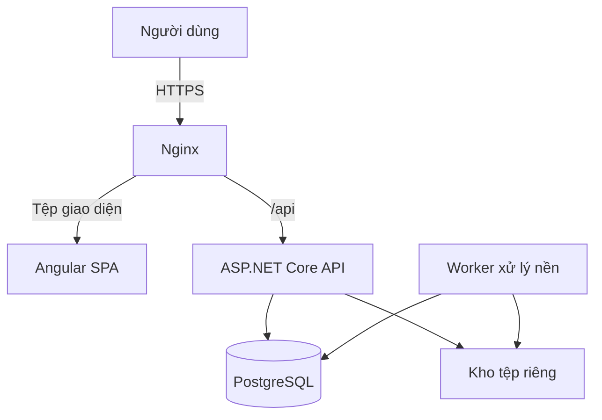
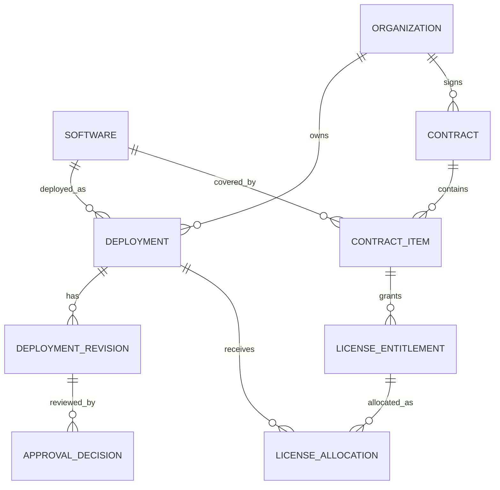
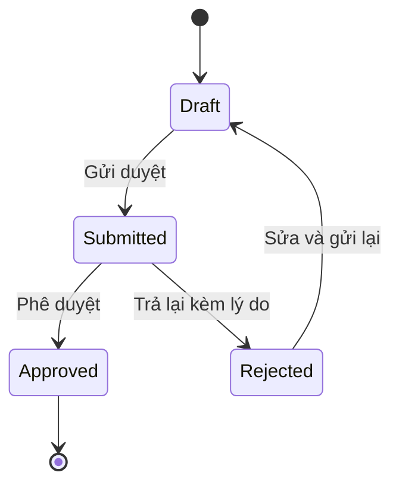

# Kiến trúc hệ thống quản lý phần mềm chuyển đổi số tại Lào Cai

> Phiên bản tài liệu: 1.1 — Cập nhật phạm vi ngày: 18/09/2026.
> Stack đã chốt: Angular + ASP.NET Core (.NET) + PostgreSQL.
> Trạng thái: thiết kế đề xuất để phát triển MVP; chưa phải kiến trúc đã nghiệm thu hoặc hệ thống đã triển khai.

## 1. Mục tiêu và phạm vi

Xây dựng web tập trung để quản lý danh mục các phần mềm đã hoàn thành, các đơn vị sử dụng, tình trạng khai thác/vận hành, hợp đồng, bản quyền, bảo trì và báo cáo phục vụ theo dõi chuyển đổi số tại Lào Cai. Không quản lý tiến độ phát triển hay tổ chức nghiệm thu sản phẩm phần mềm.

Các phần mềm được quản lý đã hoàn thành; hệ thống quản lý mô tả trong tài liệu này vẫn là dự án cần xây dựng. Deployment ghi nhận bản cài đặt/việc sử dụng tại đơn vị. Draft/Submitted/Approved/Rejected là trạng thái duyệt dữ liệu hồ sơ, không phải trạng thái hoàn thành sản phẩm.

### 1.1. Giả định thiết kế

- Người dùng chính là cán bộ cập nhật dữ liệu, người phê duyệt, người xem báo cáo và quản trị viên.
- Nhiều cơ quan/đơn vị dùng chung một hệ thống; dữ liệu nghiệp vụ được giới hạn theo phạm vi đơn vị.
- Một phần mềm có thể được triển khai tại nhiều đơn vị; một đơn vị có thể sử dụng nhiều phần mềm.
- Giao diện tiếng Việt, ưu tiên máy tính và hỗ trợ màn hình điện thoại.
- MVP dùng tài khoản nội bộ; tích hợp hệ thống đăng nhập tập trung khi có thông số kết nối chính thức.
- Chưa có số liệu thực tế về người dùng đồng thời, hạ tầng, khối lượng tệp hoặc quy trình phê duyệt. Các mục tiêu hiệu năng và vận hành trong tài liệu là đề xuất cần kiểm chứng.
- Không giả định cơ cấu tổ chức hay danh sách đơn vị hành chính cụ thể của Lào Cai. Dữ liệu này phải được cung cấp và quản lý có lịch sử.

### 1.2. Phạm vi MVP

1. Đăng nhập, tài khoản, vai trò và phạm vi truy cập.
2. Quản lý đơn vị, nhà cung cấp, nhóm phần mềm và danh mục phần mềm.
3. Quản lý các lần triển khai phần mềm tại đơn vị.
4. Quản lý hợp đồng, thời hạn bản quyền, bảo trì và tài liệu đính kèm.
5. Gửi duyệt và phê duyệt thông tin triển khai.
6. Dashboard, báo cáo, nhập/xuất Excel và thông báo trong ứng dụng.
7. Nhật ký thay đổi và công cụ vận hành cơ bản.

### 1.3. Mở rộng sau MVP

SSO, tích hợp hệ thống khác qua API, gửi email nhắc hạn, hỗ trợ sự cố, thu thập số liệu sử dụng tự động và bản đồ phân bố triển khai. Mỗi tích hợp cần thỏa thuận dữ liệu và quyền truy cập riêng.

Hệ thống không mặc định bao gồm quản lý văn bản, nhân sự, kế toán, điều khiển máy tính từ xa hoặc tự cài đặt phần mềm lên thiết bị.

## 2. Quyết định công nghệ

| Thành phần | Lựa chọn | Cách sử dụng |
| --- | --- | --- |
| Frontend | Angular 22, Angular CLI cùng major | SPA, standalone components, lazy loading theo chức năng |
| Runtime build frontend | Node.js 24 LTS, tối thiểu 24.15.0 | Chỉ dùng để build và chạy công cụ phát triển |
| Ngôn ngữ frontend | TypeScript 6.0.x | Bật strict mode; theo dải tương thích Angular |
| UI | Angular Material + CDK cùng major Angular | Form, bảng, dialog, điều hướng; SCSS cho theme |
| Trạng thái frontend | Signals + RxJS 7.x | Signals cho trạng thái giao diện; RxJS cho HTTP và luồng bất đồng bộ |
| Biểu mẫu | Reactive Forms | Kiểm tra nhập liệu và lỗi từ API |
| Biểu đồ | Apache ECharts | Tải khi mở dashboard; dùng trực tiếp nếu wrapper chưa tương thích |
| Backend | ASP.NET Core Web API, .NET 10 LTS | REST API, xác thực, phân quyền và nghiệp vụ |
| ORM | EF Core 10 + Npgsql EF provider 10 | Migration, truy vấn và transaction |
| Database | PostgreSQL 18 | Dữ liệu quan hệ, ràng buộc và báo cáo |
| Xác thực | ASP.NET Core Identity + cookie | Cùng origin với frontend; thêm OIDC khi có SSO |
| Tệp | Private filesystem qua IFileStorage | Có thể chuyển sang object storage tương thích S3 |
| Excel | ClosedXML | Nhập/xuất phía backend; chốt phiên bản và giấy phép khi khởi tạo |
| Logging | ILogger + structured JSON logs | Correlation ID, lỗi và thông tin vận hành |
| Kiểm thử | xUnit, PostgreSQL container, Playwright | Nghiệp vụ, API, phân quyền và luồng người dùng |
| Triển khai | Docker Compose + Nginx + Linux | Một cụm triển khai ban đầu, volume bền vững |

Khóa phiên bản cụ thể bằng lockfile, `global.json`, quản lý phiên bản NuGet tập trung và image tag/digest. Không dùng tag `latest` cho production. Cập nhật bản vá trong dải tương thích và kiểm thử trước khi phát hành.

Angular 22 yêu cầu TypeScript >=6.0.0 và <6.1.0; Node 24 được hỗ trợ từ 24.15.0 theo [bảng tương thích chính thức](https://angular.dev/reference/versions). Theo [chính sách Microsoft](https://dotnet.microsoft.com/en-us/platform/support/policy/dotnet-core), .NET 10 LTS được hỗ trợ đến 14/11/2028. Các phiên bản là mốc tại ngày lập tài liệu, cần kiểm tra lại khi bắt đầu triển khai.

## 3. Kiến trúc tổng thể

Chọn **modular monolith**: một backend được chia thành module nghiệp vụ, dùng một PostgreSQL database. Frontend là Angular SPA. Chưa cần microservices, message broker, Redis hoặc Kubernetes ở MVP.

- Nginx phục vụ Angular và chuyển `/api/*` đến backend trên cùng tên miền.
- Trình duyệt chỉ gọi API; không kết nối trực tiếp database hoặc kho tệp.
- Worker là tiến trình .NET chạy riêng từ cùng codebase, xử lý import/export và nhắc hạn.
- Database, API nội bộ và kho tệp không mở trực tiếp ra Internet.
- Một máy chủ là phương án khởi đầu cho thử nghiệm/MVP, không phải cấu hình có tính sẵn sàng cao.

### 3.1. Phân lớp backend

| Lớp | Trách nhiệm | Quy tắc phụ thuộc |
| --- | --- | --- |
| Domain | Entity, giá trị, trạng thái, quy tắc nghiệp vụ | Không phụ thuộc framework HTTP hoặc EF Core |
| Application | Use case, DTO, validation, interface và chính sách truy cập | Phụ thuộc Domain |
| Infrastructure | EF Core, Identity, lưu tệp, job và dịch vụ ngoài | Hiện thực interface của Application |
| API | Endpoint, xác thực HTTP, Problem Details, DI | Gọi Application; kết nối Infrastructure tại composition root |
| Worker | Nhận job, gọi use case, retry | Dùng Application và Infrastructure |

Trong mỗi lớp, tổ chức theo module. Một `AppDbContext` phục vụ MVP; dùng schema PostgreSQL theo nhóm nghiệp vụ. Không tạo generic repository chỉ để bọc lại toàn bộ EF Core. Chỉ thêm abstraction khi cần ranh giới nghiệp vụ hoặc kiểm thử có ý nghĩa.

## 4. Module nghiệp vụ

| Module | Chức năng chính | Dữ liệu sở hữu |
| --- | --- | --- |
| Identity & Access | Tài khoản, vai trò, quyền, phạm vi đơn vị | User, Role, Permission, UserRoleScope |
| Organizations | Đơn vị, cơ cấu, lịch sử tên và quan hệ | Organization, OrganizationVersion |
| Catalog | Phần mềm, nhóm, phiên bản, nhà cung cấp | Software, SoftwareRelease, Category, Vendor |
| Deployments | Ghi nhận sử dụng/vận hành phần mềm đã hoàn thành, người phụ trách | Deployment, DeploymentRevision |
| Contracts & Licenses | Hợp đồng, hạng mục, quyền sử dụng, phân bổ | Contract, ContractItem, LicenseEntitlement, LicenseAllocation |
| Documents | Tải lên, kiểm tra, tải xuống tệp | Document và bảng liên kết tệp |
| Reporting | Dashboard, báo cáo, import/export | ImportBatch, ImportRowError, ExportJob |
| Notifications | Nhắc hạn và thông báo trong web | Notification, BackgroundJob |
| Audit | Lịch sử thao tác và thay đổi dữ liệu | AuditLog |

Danh mục phần mềm dùng chung do người có quyền quản lý danh mục sửa. Đơn vị có thể gửi đề xuất bổ sung; không tự thay đổi hồ sơ chung đang được nhiều đơn vị sử dụng.

## 5. Vai trò và phân quyền

### 5.1. Vai trò mặc định

| Vai trò | Quyền mặc định |
| --- | --- |
| SystemAdmin | Tài khoản, cấu hình, gán quyền; không tự động có quyền xem mọi hợp đồng hoặc duyệt nghiệp vụ |
| CatalogManager | Quản lý danh mục dùng chung và nhà cung cấp |
| Coordinator | Xem tổng hợp, rà soát và duyệt triển khai trong phạm vi được giao |
| UnitEditor | Tạo, sửa bản nháp và gửi duyệt dữ liệu của đơn vị được giao |
| UnitApprover | Phê duyệt hoặc trả lại hồ sơ thuộc phạm vi được giao |
| Viewer | Xem dashboard và dữ liệu được cấp quyền |
| Auditor | Đọc nhật ký và dữ liệu được giao phục vụ kiểm tra |

### 5.2. Mô hình quyền

Áp dụng đồng thời ba điều kiện: **quyền thao tác + phạm vi đơn vị + trạng thái bản ghi**.

- Quyền ví dụ: `deployments.read`, `deployments.write`, `deployments.approve`, `contracts.read`, `reports.export`, `audit.read`, `access.manage`.
- `UserRoleScope` chứa `user_id`, `role_id`, `scope_type`, `organization_id`, `include_descendants`, `valid_from`, `valid_to`.
- `scope_type` là `Global` hoặc `Organization`; global chỉ được cấp rõ ràng. Không suy ra quyền toàn hệ thống từ chức danh.
- Các vai trò và phạm vi được đánh giá theo từng bản cấp quyền. Không lấy quyền ở đơn vị A ghép với phạm vi đơn vị B.
- Backend tự xác định người dùng và phạm vi hiệu lực; không tin `organizationId` hoặc role do frontend gửi.
- Mọi truy vấn danh sách, chi tiết, thống kê, tìm kiếm, tệp và export đều phải áp dụng phạm vi.
- Route guard và ẩn nút trong Angular chỉ hỗ trợ giao diện. API là nơi quyết định cuối cùng.
- Khi thu hồi quyền hoặc khóa tài khoản, cập nhật security stamp/revoke session; thời gian hiệu lực mục tiêu không quá 5 phút.
- Không cho người gửi tự duyệt bản sửa của chính mình. Ngoại lệ nếu có phải được cấu hình, ghi lý do và audit.

## 6. Thiết kế dữ liệu

### 6.1. Quy ước

- Khóa chính UUID; tên bảng/cột `snake_case`; thời điểm dùng `timestamptz` lưu UTC.
- Ngày hợp đồng thuần túy dùng `date`; hiển thị ngày giờ theo `Asia/Ho_Chi_Minh`.
- Tiền dùng `numeric(18,2)` và `currency_code`; không dùng float.
- Các entity thay đổi có `created_at`, `created_by`, `updated_at`, `updated_by` và `version` kiểu bigint.
- Mọi cập nhật tăng `version` và so sánh phiên bản cũ để chống ghi đè đồng thời.
- Danh mục đã được tham chiếu dùng archive/deactivate. Không cascade delete lịch sử triển khai, hợp đồng hoặc audit.
- JSONB chỉ dùng cho metadata linh hoạt hoặc snapshot được định nghĩa phiên bản; khóa nghiệp vụ và quan hệ vẫn là cột/FK.

### 6.2. Bảng trọng tâm

| Bảng | Trường chính / mục đích |
| --- | --- |
| organizations | id, code, is_active; định danh đơn vị ổn định |
| organization_versions | organization_id, name, parent_id, valid_from, valid_to; lịch sử tên và cơ cấu |
| organization_successions | predecessor_id, successor_id, effective_date; ghi nhận sáp nhập/chia tách, không tự chuyển quyền |
| users | Tài khoản ASP.NET Identity, display_name, is_active |
| roles / permissions / role_permissions | Vai trò và quyền thao tác |
| user_role_scopes | Cấp vai trò gắn với phạm vi và thời hạn |
| software_categories | code, name, is_active |
| vendors | code, name, contact_details |
| software | code, name, category_id, vendor_id, description, lifecycle_status |
| software_releases | software_id, version_name, release_date, support_end_date |
| deployments | software_id, organization_id, environment, instance_key, current_approved_revision_id |
| deployment_revisions | deployment_id, revision_no, release_id, operational_status, start_date (ngày tiếp nhận nếu biết), go_live_date (ngày đưa vào sử dụng), responsible_user_id, workflow_status, submitted_by, version |
| approval_decisions | deployment_revision_id, decision, reason, actor_id, decided_at |
| contracts | contract_no, owning_organization_id, vendor_id, signed_date, start_date, end_date, total_amount, currency_code |
| contract_items | contract_id, software_id, description, amount |
| license_entitlements | contract_item_id, license_type, quantity, valid_from, valid_to |
| license_allocations | entitlement_id, deployment_id, quantity; phân bổ quyền sử dụng cho lần triển khai |
| documents | storage_key, original_name, content_type, size_bytes, checksum, scan_status, uploaded_by |
| deployment_documents / contract_documents | FK đến revision hoặc hợp đồng và document; tránh liên kết đa hình không có FK |
| notifications | recipient_user_id, type, target_id, deduplication_key, read_at |
| background_jobs | type, payload, status, attempts, next_run_at, lease_until, deduplication_key |
| import_batches / import_row_errors | Người nhập, đơn vị, trạng thái, số dòng, lỗi validation |
| export_jobs | Người yêu cầu, bộ lọc, trạng thái, document_id, expires_at |
| audit_logs | actor_id, action, entity_type, entity_id, organization_id, before_json, after_json, occurred_at, correlation_id |

Mật khẩu băm do Identity quản lý; không lưu mật khẩu thô. Khóa bản quyền nếu thực sự cần lưu phải mã hóa và có quyền đọc riêng; MVP ưu tiên chỉ lưu số lượng và thời hạn quyền sử dụng.

### 6.3. Quan hệ cốt lõi

### 6.4. Ràng buộc và chỉ mục

- Unique code cho đơn vị, phần mềm và nhóm phần mềm; chuẩn hóa khoảng trắng/case trước khi lưu.
- Unique `(software_id, organization_id, environment, instance_key)` cho deployment; cho phép một phần mềm có nhiều instance có chủ đích.
- Unique `(deployment_id, revision_no)`; chỉ một revision đang `Draft` hoặc `Submitted` trên mỗi deployment.
- Số lượng license không âm; ngày kết thúc không trước ngày bắt đầu; ngày đưa vào sử dụng không trước ngày tiếp nhận nếu có cả hai. Không lưu phần trăm hoàn thành hoặc milestone phát triển phần mềm.
- Tổng phân bổ license không vượt entitlement có giới hạn; kiểm tra trong transaction và khóa bản ghi entitlement để tránh cấp vượt khi đồng thời.
- Không cho cây đơn vị có chu trình; các khoảng hiệu lực của cùng đơn vị không chồng nhau.
- Khi duyệt, `release_id` phải thuộc đúng phần mềm của deployment.
- Chỉ mục ban đầu: deployment theo đơn vị/phần mềm; revision theo trạng thái; hợp đồng theo đơn vị/ngày hết hạn; notification theo người nhận/chưa đọc; audit theo đơn vị/thời điểm.
- Tìm kiếm tiếng Việt bằng chuẩn hóa và `ILIKE` ở MVP. Chỉ thêm `pg_trgm`/`unaccent` sau khi xác định yêu cầu tìm không dấu và đo truy vấn.

### 6.5. Lịch sử tổ chức và báo cáo

Không ghi đè tên đơn vị cũ. Báo cáo tại một thời điểm phải dùng `organization_versions` tương ứng. Quyền truy cập được tính theo phân công đang hiệu lực; việc xem dữ liệu đơn vị tiền nhiệm cần cấp quyền rõ ràng. Ghi nhận sáp nhập không tự động trao quyền xem lịch sử.

## 7. Trạng thái và quy trình phê duyệt

Tách **trạng thái duyệt của revision** khỏi **trạng thái vận hành phần mềm**.

| Loại | Giá trị |
| --- | --- |
| Workflow | Draft, Submitted, Approved, Rejected |
| Sử dụng/vận hành | NotInUse (chưa sử dụng), Active (đang sử dụng), Suspended (tạm dừng), Retired (ngừng sử dụng); đều là phần mềm đã hoàn thành |

1. UnitEditor tạo deployment và revision nháp trong đơn vị được giao.
2. Backend kiểm tra quyền, trường bắt buộc, mốc thời gian và version khi gửi duyệt.
3. Revision đã gửi bị khóa sửa. Người có quyền duyệt chấp thuận hoặc trả lại kèm lý do.
4. Khi duyệt, cập nhật revision và `current_approved_revision_id`, tạo audit và job thông báo trong cùng transaction.
5. Worker gửi thông báo sau commit; lỗi gửi không làm mất kết quả duyệt.
6. Sửa dữ liệu đã duyệt tạo revision mới. Báo cáo chính thức tiếp tục đọc revision đã duyệt trước đó cho đến khi bản mới được duyệt.
7. Dashboard tách số hồ sơ chờ duyệt khỏi số triển khai chính thức; không cộng hai revision của một deployment thành hai lần triển khai.

## 8. Thiết kế API

### 8.1. Quy ước

- REST JSON, tiền tố `/api/v1`.
- DTO request/response riêng; không nhận trực tiếp EF entity từ client.
- Danh sách phân trang phía server; mặc định 20, tối đa 100 dòng/trang; whitelist trường sort/filter.
- Response danh sách: `{ "items": [], "page": 1, "pageSize": 20, "totalCount": 0 }`.
- Lỗi theo Problem Details, kèm `code`, `traceId` và lỗi từng trường khi phù hợp.
- Mã chính: 400 nhập sai, 401 chưa đăng nhập, 403 thiếu quyền, 404 không tìm thấy/ngoài phạm vi, 409 xung đột nghiệp vụ, 412 sai phiên bản ETag, 413 tệp quá lớn, 429 quá giới hạn.
- GET chi tiết trả ETag từ `version`; PUT và lệnh chuyển trạng thái yêu cầu `If-Match`. Thiếu header trả 428; version cũ trả 412 để người dùng tải lại dữ liệu.
- Job dài trả 202 cùng URL xem trạng thái. Yêu cầu tạo job hỗ trợ `Idempotency-Key`, gắn với người dùng và hash nội dung yêu cầu để chống gửi lặp.
- OpenAPI được sinh trong CI để kiểm tra contract và sinh Angular API client. Hạn chế truy cập giao diện tài liệu API trên production.

### 8.2. Endpoint dự kiến

| Method | Endpoint | Chức năng |
| --- | --- | --- |
| GET | /auth/csrf | Khởi tạo token chống CSRF |
| POST | /auth/login | Đăng nhập nội bộ |
| POST | /auth/logout | Đăng xuất |
| GET | /auth/me | Hồ sơ, quyền và phạm vi của phiên hiện tại |
| GET, POST | /organizations | Danh sách / tạo đơn vị |
| PUT | /organizations/{id} | Thay đổi thông tin có hiệu lực theo thời gian |
| GET, POST | /software | Tra cứu / tạo phần mềm |
| GET, PUT | /software/{id} | Chi tiết / cập nhật phần mềm |
| POST | /software/{id}/releases | Thêm phiên bản phần mềm |
| GET, POST | /deployments | Danh sách / tạo hồ sơ triển khai |
| GET | /deployments/{id} | Xem hồ sơ và revision được phép đọc |
| POST | /deployments/{id}/revisions | Tạo bản sửa mới |
| PUT | /deployment-revisions/{id} | Sửa bản nháp |
| POST | /deployment-revisions/{id}/submit | Gửi duyệt |
| POST | /deployment-revisions/{id}/approve | Phê duyệt |
| POST | /deployment-revisions/{id}/reject | Trả lại kèm lý do |
| GET, POST | /contracts | Danh sách / tạo hợp đồng |
| GET, PUT | /contracts/{id} | Chi tiết / sửa hợp đồng |
| POST | /license-entitlements/{id}/allocations | Phân bổ license cho deployment |
| POST | /deployment-revisions/{id}/documents | Upload tệp gắn với hồ sơ có quyền sửa |
| POST | /contracts/{id}/documents | Upload tệp hợp đồng |
| GET | /documents/{id}/download | Tải tệp sau kiểm tra quyền tài nguyên cha |
| GET | /reports/overview | Dashboard theo phạm vi |
| POST | /imports/deployments | Upload Excel và tạo job kiểm tra |
| POST | /imports/{id}/commit | Ghi các dòng hợp lệ theo chính sách import |
| POST | /exports/deployments | Tạo export job |
| GET | /jobs/{id} | Xem trạng thái job thuộc quyền người dùng |
| GET | /notifications | Thông báo cá nhân |
| GET | /audit-logs | Tra cứu nhật ký được cấp quyền |

## 9. Xác thực và bảo vệ dữ liệu

### 9.1. Đăng nhập web

- Dùng cookie phiên `HttpOnly`, `Secure`, `SameSite=Lax` và giới hạn domain/path phù hợp.
- Các request thay đổi dữ liệu, kể cả login/logout, phải có antiforgery token. Angular gửi header XSRF; backend cấu hình đúng tên cookie/header tương ứng.
- Cấu hình Identity trả 401/403 cho API, không redirect sang trang HTML đăng nhập.
- Không lưu token đăng nhập trong localStorage.
- Thời hạn nhàn rỗi đề xuất 30 phút và thời hạn tuyệt đối 8 giờ; xác nhận lại theo chính sách đơn vị.
- Rate limit đăng nhập, khóa tạm khi thử sai nhiều lần và bật MFA cho tài khoản quản trị khi đưa vào vận hành.
- Lưu Data Protection keys trên volume bền vững, giới hạn quyền đọc và sao lưu bảo mật. Nếu tăng số API instance, chia sẻ key ring và cơ chế thu hồi phiên.
- Khi tích hợp SSO, backend thực hiện OIDC authorization code flow và tạo phiên cookie cho web; không tự xây dựng máy chủ OAuth.

### 9.2. Tệp và nhật ký

- Tệp nằm ngoài webroot; tên lưu là UUID, không sử dụng đường dẫn client gửi.
- Allowlist loại tệp và kiểm tra nội dung thực; giới hạn ban đầu 20 MB/tệp, cấu hình đồng bộ ở Nginx/API.
- Upload vào vùng cách ly; chỉ cho tải khi đạt kiểm tra an toàn. Có thể dùng ClamAV hoặc dịch vụ quét do đơn vị cung cấp; lỗi quét giữ tệp ở trạng thái chờ.
- API tải tệp kiểm tra quyền đối tượng cha tại thời điểm tải; export cũng kiểm tra lại quyền và tự hết hạn.
- Không ghi mật khẩu, cookie, secret hoặc khóa license vào log/audit. Che hoặc bỏ dữ liệu nhạy cảm khỏi snapshot.
- Audit thay đổi nghiệp vụ được ghi cùng transaction; tài khoản ứng dụng không có quyền sửa/xóa audit thông thường.
- TLS, secret ngoài repository, phân tách môi trường và backup mã hóa là yêu cầu triển khai. Thời hạn lưu trữ/phân loại dữ liệu cần chủ quản xác nhận; tài liệu không tự tuyên bố đáp ứng một tiêu chuẩn pháp lý cụ thể.

## 10. Thiết kế Angular

### 10.1. Tổ chức mã nguồn

| Thư mục | Nội dung |
| --- | --- |
| frontend/src/app/core | Phiên đăng nhập, interceptor, xử lý lỗi, cấu hình |
| frontend/src/app/shared | Component/pipes dùng chung, không chứa nghiệp vụ module |
| frontend/src/app/api | Client và model sinh từ OpenAPI |
| frontend/src/app/layout | Khung trang, menu, breadcrumb |
| frontend/src/app/features/dashboard | Dashboard theo quyền |
| frontend/src/app/features/organizations | Đơn vị và lịch sử tổ chức |
| frontend/src/app/features/software | Danh mục và phiên bản phần mềm |
| frontend/src/app/features/deployments | Danh sách, chi tiết, sửa và duyệt triển khai |
| frontend/src/app/features/contracts | Hợp đồng và license |
| frontend/src/app/features/reports | Bộ lọc, import/export và tiến độ job |
| frontend/src/app/features/admin | Người dùng, quyền, audit |

### 10.2. Quy tắc giao diện

- Lazy load theo feature; ưu tiên Signals và service cục bộ, chưa cần NgRx toàn hệ thống.
- Reactive Forms, thông báo lỗi từng trường; server vẫn kiểm tra toàn bộ dữ liệu.
- Bảng lọc/phân trang server-side; lưu bộ lọc trong URL để chia sẻ và quay lại.
- Tìm kiếm debounce, hủy request cũ, không tự retry thao tác ghi có thể tạo dữ liệu trùng.
- Hiển thị rõ bản nháp/bản đã duyệt, lịch sử chỉnh sửa và trạng thái xử lý.
- Có loading, empty, error, forbidden, session-expired và conflict state.
- Hỗ trợ bàn phím, label đầy đủ, độ tương phản và thông báo không chỉ dựa vào màu.
- Không cache dữ liệu nhạy cảm bằng service worker ở MVP; xóa trạng thái người dùng khi logout.

## 11. Báo cáo, import/export và job

### 11.1. Chỉ số có định nghĩa rõ

| Chỉ số | Cách tính đề xuất |
| --- | --- |
| Số phần mềm sử dụng | Đếm software_id khác nhau có deployment đã duyệt trong phạm vi |
| Số lượt triển khai | Đếm deployment, chỉ dùng revision đã duyệt hiện hành |
| Đơn vị có phần mềm hoạt động | Đếm organization_id khác nhau có trạng thái Active |
| Tỷ lệ bao phủ | Đơn vị đủ điều kiện có triển khai Active / tổng đơn vị đủ điều kiện; tập đơn vị do quản trị cấu hình |
| Hợp đồng sắp hết hạn | end_date trong khoảng cảnh báo và chưa kết thúc/hủy |
| Tổng giá trị hợp đồng | Cộng mỗi hợp đồng một lần theo đơn vị sở hữu và kỳ lọc; không nhân theo số deployment |

Không cộng tiền khác loại tiền tệ. Không suy ra mức độ sử dụng thực tế chỉ từ trạng thái Active; số người dùng/lượt truy cập chỉ hiển thị khi có nguồn dữ liệu và kỳ đo rõ ràng.

### 11.2. Import/export

Import hai bước: tải lên và kiểm tra → người dùng xem lỗi/xác nhận → ghi dữ liệu. Dữ liệu nhập triển khai tạo bản nháp, không tự duyệt. MVP chọn commit toàn bộ hoặc không commit; giới hạn đề xuất 5.000 dòng/lần để kiểm soát bộ nhớ và transaction. Kiểm tra mã trùng, phạm vi đơn vị, ngày tháng và tệp trước khi ghi.

Export lớn chạy nền, đọc theo batch và chỉ lấy cột được phép. Giá trị do người dùng nhập được ghi dưới dạng text khi có nguy cơ thành công thức Excel. Job kiểm tra quyền lúc thực thi và lúc tải kết quả; file tạm đề xuất hết hạn sau 24 giờ.

### 11.3. Worker bền vững

Dùng bảng job PostgreSQL và một Worker .NET. Worker nhận job bằng transaction với `FOR UPDATE SKIP LOCKED`, đặt lease, gia hạn khi xử lý dài và thu hồi job hết lease. Áp dụng tối đa 5 lần thử với backoff; job lỗi cuối cùng có thể được quản trị chạy lại.

Nhắc hạn 30/15/7 ngày là cấu hình đề xuất. Unique deduplication key theo đối tượng, ngày hết hạn, ngưỡng nhắc và người nhận giúp tránh thông báo trùng. Việc tạo job gắn với cập nhật nghiệp vụ nằm trong cùng transaction; side effect bên ngoài phải idempotent vì có thể chạy lại sau sự cố.

## 12. Cấu trúc repository

| Đường dẫn | Vai trò |
| --- | --- |
| frontend/ | Angular workspace |
| backend/src/LaoCai.SoftwareManagement.Domain/ | Entity và quy tắc miền |
| backend/src/LaoCai.SoftwareManagement.Application/ | Use case theo module |
| backend/src/LaoCai.SoftwareManagement.Infrastructure/ | EF Core, Identity, storage, jobs |
| backend/src/LaoCai.SoftwareManagement.Api/ | Web API và composition root |
| backend/src/LaoCai.SoftwareManagement.Worker/ | Tiến trình xử lý nền |
| backend/tests/ | Unit và integration tests |
| e2e/ | Playwright scenarios |
| deploy/ | Dockerfile, Compose, Nginx và mẫu cấu hình không chứa secret |
| docs/architecture.md | Tài liệu kiến trúc |
| docs/adr/ | Các quyết định kiến trúc thay đổi theo thời gian |

Môi trường: `Development`, `Staging`, `Production` có database, tài khoản và secret riêng. Staging chỉ dùng dữ liệu giả hoặc đã ẩn danh.

## 13. Triển khai và vận hành

### 13.1. Cấu hình MVP đề xuất

- Một VM Linux: 4 vCPU, RAM 8 GB, SSD 100 GB để bắt đầu thử tải; đây không phải cam kết đáp ứng quy mô toàn tỉnh.
- Container: Nginx, API, Worker, PostgreSQL và bộ quét tệp nếu triển khai tại chỗ.
- Volume riêng cho PostgreSQL, tài liệu và Data Protection keys; không lưu dữ liệu quan trọng trên lớp filesystem tạm của container.
- Chỉ public HTTPS; cổng database không public; SSH qua VPN hoặc nguồn IP quản trị được phép.
- Backup ở nơi độc lập với máy chủ chính. Dung lượng thực tế phải tính thêm tệp, WAL, log và thời gian lưu.

### 13.2. CI/CD

1. Restore theo lockfile; lint/typecheck/build frontend; build backend.
2. Chạy test nghiệp vụ, integration PostgreSQL và E2E quan trọng.
3. Kiểm tra dependency, secret và build image có version.
4. Triển khai staging, chạy migration và smoke test.
5. Trước production: kiểm tra backup, kế hoạch khôi phục và cửa sổ bảo trì.
6. Chạy migration bằng một tiến trình riêng có quyền schema; không tự migrate đồng thời trong mọi API instance.
7. Triển khai image, kiểm tra health/readiness và luồng đăng nhập/tra cứu.

Migration ưu tiên expand–contract: thêm cấu trúc tương thích trước, chuyển ứng dụng, sau đó mới xóa cấu trúc cũ. Rollback image chỉ an toàn khi schema còn tương thích; khôi phục database là bước riêng và có thể mất dữ liệu phát sinh sau điểm backup.

### 13.3. Backup và giám sát

- Mục tiêu production đề xuất: RPO <=1 giờ, RTO <=4 giờ. Cần xác nhận bằng diễn tập trên hạ tầng thực tế.
- Để đạt RPO, dùng base backup định kỳ và lưu WAL liên tục cho PITR; chỉ dump mỗi đêm không đáp ứng mục tiêu 1 giờ.
- Sao lưu/version hóa kho tệp cùng metadata; quy trình khôi phục phải kiểm tra tệp tham chiếu không bị thiếu. Hoãn xóa vật lý tệp theo thời hạn lưu backup.
- Đề xuất lưu backup ngày 30 ngày, bản tháng 12 tháng; chủ quản quyết định thời hạn chính thức.
- Diễn tập khôi phục ít nhất mỗi quý và sau thay đổi lớn.
- Theo dõi HTTP 5xx, độ trễ, CPU/RAM/disk, connection pool, job thất bại, độ trễ nhắc hạn và lần backup thành công gần nhất.
- `/health/live` kiểm tra tiến trình; `/health/ready` kiểm tra phụ thuộc thiết yếu. Không trả secret hoặc chi tiết kết nối cho người ngoài.

## 14. Kiểm thử và tiêu chí nghiệm thu

### 14.1. Các kiểm thử bắt buộc

| Nhóm | Trường hợp trọng tâm |
| --- | --- |
| Phân quyền | Người đơn vị A không đọc/sửa/tải tệp/export dữ liệu B, kể cả đổi ID trên URL |
| Phạm vi | Không ghép quyền ở A với phạm vi B; thu hồi quyền tác động đến phiên hiện tại |
| Workflow | Không sửa revision đang duyệt; không tự duyệt; sửa bản đã duyệt tạo revision mới |
| Đồng thời | Hai người cập nhật cùng version không ghi đè; hai phê duyệt chỉ một thành công |
| License | Phân bổ đồng thời không vượt entitlement |
| Báo cáo | Không đếm revision thành deployment, không nhân đôi chi phí hợp đồng |
| Tổ chức | Đổi tên/sáp nhập không làm sai báo cáo lịch sử và không tự mở rộng quyền |
| Tệp | Chặn tệp quá lớn, giả loại, chưa quét và tải ngoài phạm vi |
| Import/job | Không commit một phần khi chọn all-or-nothing; retry không tạo bản ghi trùng |
| Khôi phục | Phục hồi được database, tệp và cấu hình thiết yếu từ backup độc lập |

### 14.2. Mục tiêu hiệu năng thử nghiệm

Khởi đầu đo với 100 người dùng đồng thời, 100.000 deployment và 1 triệu dòng audit. Đây là bộ tải kiểm thử đề xuất, không phải số liệu thực tế hoặc giới hạn hệ thống.

- API danh sách phổ biến: p95 <1 giây, không tính thời gian mạng ngoài hệ thống.
- Dashboard với bộ lọc thông thường: p95 <3 giây.
- Import/export lớn chạy nền, hiển thị tiến độ; không khóa luồng request dài.
- Ghi rõ cấu hình máy, kích thước dữ liệu và cách tạo tải trong biên bản thử. Tối ưu query/index trước khi thêm cache hoặc tách dịch vụ.

## 15. Thứ tự thực hiện

| Giai đoạn | Kết quả cần có |
| --- | --- |
| 1. Chốt nghiệp vụ | Danh sách đơn vị, form nhập, quyền, quy trình duyệt và mẫu báo cáo |
| 2. Nền tảng | Repository, CI, đăng nhập, scope, migration, audit và giao diện khung |
| 3. Dữ liệu chính | Đơn vị, danh mục, phiên bản, deployment và revision |
| 4. Quy trình | Gửi duyệt, phê duyệt, hợp đồng, license và tài liệu |
| 5. Tổng hợp | Dashboard, import/export và nhắc hạn |
| 6. Pilot | Dữ liệu mẫu, kiểm thử quyền/hiệu năng, diễn tập restore và hướng dẫn người dùng |
| 7. Vận hành | Hạ tầng đã xác nhận, giám sát, backup, tài khoản bàn giao và quy trình hỗ trợ |

Không ấn định thời lượng khi chưa biết quy mô nhóm và mức tích hợp. Pilot với một nhóm đơn vị trước khi mở rộng.

## 16. Các điểm cần xác nhận trước khi viết mã nghiệp vụ

1. Phạm vi đã xác nhận là quản lý phần mềm đã hoàn thành và tình trạng sử dụng/vận hành; cần chốt biểu mẫu và trường thông tin của hồ sơ.
2. Danh sách, mã và lịch sử cơ cấu đơn vị do nguồn nào cung cấp?
3. Ai được quản lý danh mục chung, duyệt triển khai, xem hợp đồng và xuất dữ liệu?
4. Quy trình duyệt một cấp hay nhiều cấp? Có yêu cầu ký số không?
5. Hạ tầng đặt tại đơn vị hay nhà cung cấp; có sẵn SSO, SMTP, kho tệp hoặc công cụ giám sát không?
6. Số người dùng, mức đồng thời, số phần mềm, deployment và dung lượng tài liệu dự kiến?
7. Các biểu mẫu Excel/báo cáo và định nghĩa chỉ số chính thức?
8. Yêu cầu thời gian lưu dữ liệu, sao lưu, thời gian ngừng dịch vụ và phân loại thông tin?

Các câu hỏi này không thay đổi stack đã chọn, nhưng có thể thay đổi phân quyền, workflow, mô hình dữ liệu và quy mô hạ tầng.

## 17. Nguồn kỹ thuật

- [Angular — Version compatibility](https://angular.dev/reference/versions): dải Node.js, TypeScript và RxJS tương thích.
- [Angular — Versioning and releases](https://angular.dev/reference/releases): chính sách phát hành và hỗ trợ.
- [Angular Material](https://material.angular.dev/): thư viện UI.
- [.NET — Support policy](https://dotnet.microsoft.com/en-us/platform/support/policy/dotnet-core): vòng đời .NET 10 LTS.
- [Npgsql EF Core 10 release notes](https://www.npgsql.org/efcore/release-notes/10.0.html): provider PostgreSQL cho EF Core 10.
- [PostgreSQL — Versioning policy](https://www.postgresql.org/support/versioning/): phiên bản và thời gian hỗ trợ.

Các lựa chọn module, schema, quyền, quy trình và chỉ tiêu vận hành ở trên là thiết kế đề xuất cho dự án, không phải thông tin đã xác nhận về hệ thống hiện hữu của Lào Cai.
