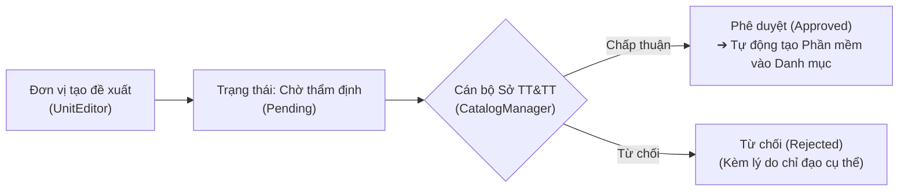
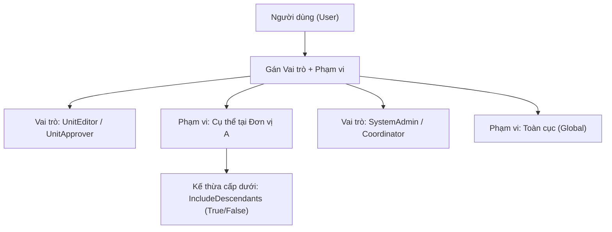

# SỔ TAY HƯỚNG DẪN SỬ DỤNG HỆ THỐNG
## HỆ THỐNG QUẢN LÝ PHẦN MỀM CHUYỂN ĐỔI SỐ TỈNH LÀO CAI

---

> **Cơ quan phát hành**: Sở Thông tin và Truyền thông tỉnh Lào Cai  
> **Phiên bản tài liệu**: 2.0.0  
> **Hệ thống áp dụng**: Cổng thông tin & Ứng dụng Quản lý phần mềm dùng chung (`https://phanmem.laocai.gov.vn` hoặc `http://localhost:4200` tại mạng nội bộ)  

---

## MỤC LỤC TỔNG QUAN

1. [Tổng quan Hệ thống & Tài khoản Truy cập](#1-tổng-quan-hệ-thống--tài-khoản-truy-cập)
2. [Đăng nhập, Quản lý Hồ sơ & Điều hướng Chung](#2-đăng-nhập-quản-lý-hồ-sơ--điều-hướng-chung)
3. [Chức năng 1: Dashboard & Trung tâm Báo cáo Chỉ số](#3-chức-năng-1-dashboard--trung-tâm-báo-cáo-chỉ-số)
4. [Chức năng 2: Quản lý Danh mục Phần mềm Dùng chung](#4-chức-năng-2-quản-lý-danh-mục-phần-mềm-dùng-chung)
5. [Chức năng 3: Đề xuất Bổ sung Phần mềm Mới](#5-chức-năng-3-đề-xuất-bổ-sung-phần-mềm-mới)
6. [Chức năng 4: Quản lý Hồ sơ Triển khai & Cài đặt](#6-chức-năng-4-quản-lý-hồ-sơ-triển-khai--cài-đặt)
7. [Chức năng 5: Tiện ích Nhập / Xuất Dữ liệu Excel (All-or-Nothing)](#7-chức-năng-5-tiện-ích-nhập--xuất-dữ-liệu-excel-all-or-nothing)
8. [Chức năng 6: Quản lý Hợp đồng & Bản quyền (License)](#8-chức-năng-6-quản-lý-hợp-đồng--bản-quyền-license)
9. [Chức năng 7: Quản lý Cơ quan & Đơn vị Hành chính](#9-chức-năng-7-quản-lý-cơ-quan--đơn-vị-hành-chính)
10. [Chức năng 8: Quản trị Người dùng & Phân quyền Phạm vi (Scope-based)](#10-chức-năng-8-quản-trị-người-dùng--phân-quyền-phạm-vi-scope-based)
11. [Chức năng 9: Nhật ký Kiểm toán Hệ thống (Audit Logs)](#11-chức-năng-9-nhật-ký-kiểm-toán-hệ-thống-audit-logs)
12. [Chức năng 10: Quản trị Tiến trình Nền (Worker Background Jobs)](#12-chức-năng-10-quản-trị-tiến-trình-nền-worker-background-jobs)
13. [Phụ lục: Ma trận Phân quyền Thao tác theo Vai trò](#13-phụ-lục-ma-trận-phân-quyền-thao-tác-theo-vai-trò)

---

## 1. TỔNG QUAN HỆ THỐNG & TÀI KHOẢN TRUY CẬP

### 1.1. Mục tiêu hệ thống
Hệ thống là nền tảng quản trị tập trung toàn tỉnh Lào Cai nhằm:
- Thống nhất danh mục các phần mềm, nền tảng số dùng chung cấp tỉnh.
- Theo dõi toàn bộ hồ sơ triển khai, phiên bản vận hành tại từng Sở, Ban, Ngành, UBND huyện, thị xã, thành phố đến cấp xã/phường.
- Kiểm soát hợp đồng CNTT, hạn mức bản quyền (License Quota), hạn bảo trì, tránh thất thoát ngân sách.
- Chuẩn hóa quy trình thẩm định, phê duyệt và kiểm toán dữ liệu với độ an toàn cao.

### 1.2. Danh sách Tài khoản Kiểm thử & Trải nghiệm theo Vai trò
Hệ thống đã chuẩn bị sẵn các tài khoản mẫu tương ứng với từng cấp độ nghiệp vụ:

| Tên đăng nhập | Mật khẩu mặc định | Tên hiển thị | Vai trò nghiệp vụ (`RoleCode`) | Phạm vi quyền (`Scope`) |
| :--- | :--- | :--- | :--- | :--- |
| **`admin`** | `Admin@123456` | Quản trị viên Hệ thống | `SystemAdmin` | Toàn quyền hệ sinh thái (**Global**) |
| **`catalog_mgr`** | `User@123456` | Cán bộ Quản lý Danh mục Sở | `CatalogManager` | Quản lý danh mục & duyệt đề xuất (**Global**) |
| **`coordinator`** | `User@123456` | Điều phối viên Sở TTTT | `Coordinator` | Quản lý hợp đồng & phân bổ License (**Global**) |
| **`editor_baothang`** | `User@123456` | Chuyên viên CNTT Huyện Bảo Thắng | `UnitEditor` | Khởi tạo, chỉnh sửa hồ sơ (Đơn vị **UBND Huyện Bảo Thắng**) |
| **`approver_baothang`** | `User@123456` | Lãnh đạo UBND Huyện Bảo Thắng | `UnitApprover` | Duyệt/Từ chối hồ sơ (Đơn vị **UBND Huyện Bảo Thắng**) |
| **`viewer_prov`** | `User@123456` | Cán bộ Giám sát Tỉnh | `Viewer` | Xem báo cáo & dashboard tra cứu (**Global**) |
| **`auditor`** | `User@123456` | Kiểm toán viên Nhà nước | `Auditor` | Tra cứu vết lịch sử kiểm toán (**Global**) |

---

## 2. ĐĂNG NHẬP, QUẢN LÝ HỒ SƠ & ĐIỀU HƯỚNG CHUNG

### 2.1. Đăng nhập Hệ thống
1. Mở trình duyệt web (Google Chrome, Microsoft Edge, Firefox, Cốc Cốc) và truy cập địa chỉ hệ thống.
2. Tại màn hình Đăng nhập:
   - Nhập **Tên đăng nhập** (ví dụ: `admin`).
   - Nhập **Mật khẩu** (ví dụ: `Admin@123456`).
   - Bấm nút **Đăng nhập hệ thống ➔**.
3. Khi đăng nhập thành công:
   - Hệ thống tự động thiết lập Cookie phiên an toàn (`LaoCai_Session`) và mã bảo mật chống giả mạo (`XSRF-TOKEN`).
   - Tự động chuyển hướng vào màn hình **Dashboard & Báo cáo Tổng quan**.

> [!TIP]
> Nếu hệ thống hiển thị thông báo lỗi, hãy kiểm tra lại trạng thái bàn phím (Caps Lock hoặc bộ gõ tiếng Việt Telex/VNI).

### 2.2. Trung tâm Thông báo (Notification Bell 🔔)
Ở góc trên bên phải màn hình:
1. Biểu tượng chuông hiển thị số lượng thông báo chưa đọc dạng huy hiệu đỏ (`1`, `2`, `99+`).
2. Nhấp vào chuông để mở danh sách thông báo gần đây:
   - **📋 Hồ sơ gửi duyệt**: Thông báo khi có chuyên viên gửi hồ sơ triển khai mới.
   - **✅ Hồ sơ đã duyệt**: Thông báo khi lãnh đạo đã phê duyệt hồ sơ chính thức.
   - **❌ Hồ sơ bị từ chối**: Cảnh báo khi hồ sơ bị trả lại kèm lý do chỉ đạo.
3. Nhấp vào từng dòng thông báo để mở trực tiếp hồ sơ tương ứng.
4. Bấm **Đánh dấu đã đọc** để xóa trạng thái thông báo mới.

### 2.3. Đổi Mật khẩu Cá nhân & Đăng xuất
1. Nhấp vào **Tên & Avatar** của bạn ở góc phải thanh tiêu đề ➔ Menu trượt xuống.
2. Chọn **🔑 Đổi mật khẩu**:
   - Nhập **Mật khẩu hiện tại**.
   - Nhập **Mật khẩu mới** (tối thiểu 6 ký tự, khuyến nghị bao gồm chữ hoa, chữ thường, số và ký tự đặc biệt).
   - Bấm **Lưu thay đổi**.
3. Chọn **🚪 Đăng xuất** để xóa phiên làm việc an toàn trên máy tính dùng chung.

### 2.4. Thanh Menu Điều hướng (Sidebar)
Thanh menu bên trái giúp chuyển đổi linh hoạt giữa các phân hệ:
- Nút **☰** ở góc trái trên cùng dùng để **Thu gọn / Mở rộng** thanh menu.
- Các mục trên thanh menu được tự động phân quyền hiển thị theo đúng vai trò tài khoản đăng nhập.

---

## 3. CHỨC NĂNG 1: DASHBOARD & TRUNG TÂM BÁO CÁO CHỈ SỐ
*Đường dẫn: `/dashboard`*

### 3.1. Ý nghĩa các chỉ số đo lường (KPI Cards)
Ngay đầu màn hình, hệ thống cung cấp 4 thẻ chỉ số thời gian thực:
1. **Tổng số phần mềm dùng chung**: Số lượng phần mềm trong danh mục chính thức của tỉnh.
2. **Tổng số hồ sơ triển khai**: Số lượng bản cài đặt tại các cơ quan, đơn vị trên địa bàn tỉnh.
3. **Tỷ lệ phủ số hóa**: Tỷ lệ phần trăm đơn vị cấp huyện/sở đã triển khai đầy đủ các phần mềm lõi.
4. **Hợp đồng & Bản quyền**: Tổng số hợp đồng đang có hiệu lực và tỷ lệ ghế License đã cấp phát.

### 3.2. Hệ thống Biểu đồ Trực quan hóa (Interactive Charts)
- **Biểu đồ Độ phủ theo Đơn vị (Coverage by Organization)**: So sánh số lượng phần mềm đã vận hành giữa các Sở, Huyện.
- **Biểu đồ Cơ cấu theo Nhóm chức năng (Distribution by Category)**: Thống kê tỷ trọng phần mềm nhóm Chính quyền số (E-Gov), Y tế, Giáo dục, Đô thị thông minh...
- **Biểu đồ Trạng thái Triển khai (Deployment Status Chart)**: Tỷ lệ phân bố giữa các môi trường `Production`, `Staging`, `Development`, `DR` và trạng thái phê duyệt.

### 3.3. Thao tác Bộ lọc & Xuất nhanh
- Người dùng có thể chọn bộ lọc **Khoảng thời gian** hoặc **Nhóm đơn vị** để các biểu đồ tự động cập nhật lại số liệu.

---

## 4. CHỨC NĂNG 2: QUẢN LÝ DANH MỤC PHẦN MỀM DÙNG CHUNG
*Đường dẫn: `/software`*

### 4.1. Tra cứu & Xem chi tiết Phần mềm
1. Vào menu **Danh mục Phần mềm**.
2. Sử dụng thanh tìm kiếm: Nhập tên phần mềm, từ khóa hoặc mã viết tắt (ví dụ: `QLVB`, `DVC`, `IOC`, `CSDL`).
3. Lọc theo **Nhóm danh mục** hoặc **Nhà cung cấp / Đối tác phát triển** (VNPT, Viettel, Mobifone, FPT, MISA...).
4. Nhấp vào tên phần mềm để mở trang chi tiết:
   - Thông tin giới thiệu, mục đích sử dụng.
   - Kiến trúc công nghệ (Web, Mobile, Desktop), cơ sở dữ liệu.
   - Danh sách các phiên bản đã phát hành (Releases).
   - Danh sách các đơn vị đang triển khai thực tế.

### 4.2. Thêm mới Phần mềm vào Danh mục *(Quyền `catalog.manage`)*
1. Bấm nút **+ Thêm Phần mềm Mới**.
2. Điền các trường thông tin bắt buộc:
   - **Tên phần mềm**: Tên chính thức (ví dụ: *Hệ thống Quản lý Văn bản và Điều hành tỉnh Lào Cai*).
   - **Mã định danh (Code)**: Viết hoa, không dấu (ví dụ: `LC-EGOV-DOCS`).
   - **Nhóm danh mục**: Chọn từ danh mục (Chính quyền số, Nội chính, Tài chính công...).
   - **Nhà phát triển / Đơn vị cung cấp**: Chọn đơn vị xây dựng phần mềm.
   - **Mô tả chức năng chính**: Tóm tắt phạm vi đáp ứng.
3. Bấm **Lưu danh mục**.

### 4.3. Quản lý Phiên bản Phát hành (Software Releases)
Tại trang chi tiết phần mềm:
1. Chuyển sang tab **Phiên bản (Releases)**.
2. Bấm **+ Thêm Phiên bản Phát hành**:
   - **Số phiên bản**: Ví dụ `v2.5.0` hoặc `2026.1`.
   - **Ngày phát hành (Release Date)**.
   - **Nhật ký thay đổi (Release Notes / Changelog)**: Các tính năng nâng cấp, lỗi đã vá.
   - **Trạng thái**: Đánh dấu `Đang lưu hành (Active)`, `Khuyến nghị nâng cấp (Recommended)` hoặc `Ngừng hỗ trợ (Deprecated)`.
3. Bấm **Xác nhận lưu phiên bản**.

---

## 5. CHỨC NĂNG 3: ĐỀ XUẤT BỔ SUNG PHẦN MỀM MỚI
*Đường dẫn: `/software/proposals`*

Quy trình thẩm định 2 bước giúp các đơn vị cấp huyện/sở chủ động đề xuất đưa phần mềm tự xây dựng hoặc thuê dịch vụ vào danh mục chuẩn của tỉnh.

### 5.1. Cán bộ Đơn vị gửi Đề xuất mới *(Quyền `catalog.propose`)*
1. Vào menu **Đề xuất Bổ sung DM** ➔ bấm **+ Gửi Đề xuất Mới**.
2. Điền thông tin đề xuất:
   - **Tên phần mềm đề xuất**.
   - **Nhà cung cấp / Đối tác triển khai**.
   - **Sự cần thiết & Căn cứ pháp lý**: Giải trình mục đích sử dụng tại cơ quan.
   - **Đính kèm tài liệu thuyết minh / Báo cáo nghiệm thu** (tệp PDF).
3. Bấm **Gửi đề xuất tới Sở TT&TT**.

### 5.2. Sở TT&TT Thẩm định & Phê duyệt Đề xuất *(Quyền `catalog.manage`)*
1. Cán bộ Sở mở danh sách đề xuất, lọc trạng thái **Chờ duyệt (Pending)**.
2. Nhấp vào hồ sơ đề xuất để thẩm định tài liệu kỹ thuật.
3. Ra quyết định:
   - **Duyệt đề xuất (Approve)**: Hệ thống lập tức kích hoạt quy trình tự động chuyển đề xuất thành một **Phần mềm chính thức** trong Danh mục Dùng chung của tỉnh.
   - **Từ chối đề xuất (Reject)**: Bắt buộc nhập **Lý do từ chối** để đơn vị đề xuất nhận thông báo và điều chỉnh hồ sơ.

---

## 6. CHỨC NĂNG 4: QUẢN LÝ HỒ SƠ TRIỂN KHAI & CÀI ĐẶT
*Đường dẫn: `/deployments` & `/deployments/:id`*

Đây là phân hệ lõi theo dõi việc cài đặt, cấu hình, phiên bản và tình trạng hoạt động của phần mềm tại từng cơ quan.

### 6.1. Vòng đời Trạng thái Hồ sơ Triển khai (State Machine)
Hệ thống quản lý trạng thái hồ sơ theo chuẩn kiểm soát chất lượng:
- **`Draft` (Bản nháp)**: Chuyên viên đang chuẩn bị dữ liệu, tải tài liệu, chưa gửi cấp trên.
- **`Submitted` (Chờ duyệt)**: Chuyên viên đã hoàn tất và khóa sửa, gửi Lãnh đạo thẩm định.
- **`Approved` (Đã duyệt)**: Hồ sơ chính thức, được tính vào các chỉ số Dashboard toàn tỉnh.
- **`Rejected` (Từ chối)**: Bị trả lời từ chối duyệt kèm văn bản/ý kiến. Cho phép bấm **Mở lại (Reopen)** để sửa thành Draft.
- **`Decommissioned` (Thu hồi/Ngừng dùng)**: Phần mềm đã hết vòng đời hoặc đơn vị chuyển sang nền tảng khác.

---

### 6.2. Hướng dẫn dành cho Cán bộ Đơn vị (UnitEditor)

#### Bước 1: Khởi tạo Hồ sơ Mới
1. Vào menu **Hồ sơ Triển khai** ➔ Bấm **+ Thêm Hồ sơ Triển khai**.
2. Điền thông tin kỹ thuật:
   - **Phần mềm**: Chọn từ danh mục chung của tỉnh.
   - **Cơ quan / Đơn vị tiếp nhận**: Mặc định đơn vị của bạn (ví dụ: *UBND Huyện Bảo Thắng*).
   - **Môi trường vận hành**: Chọn `Production` (Chính thức), `Staging` (Kiểm thử), `Development` hoặc `DR` (Dự phòng thảm họa).
   - **Định danh phiên bản cài đặt (Instance Key)**: Chuỗi ký tự duy nhất (ví dụ: `ubnd-baothang-qlvb-prod`).
   - **Phiên bản cài đặt**: Chọn phiên bản phát hành tương ứng.
   - **Ngày bàn giao tiếp nhận & Ngày bắt đầu vận hành**.
   - **Cán bộ quản trị phụ trách**: Họ tên và số điện thoại kỹ thuật.
3. Bấm **Lưu bản nháp**.

#### Bước 2: Đính kèm Hồ sơ Nghiệm thu & Tài liệu Kỹ thuật
1. Tại trang chi tiết hồ sơ, chuyển sang tab **Tài liệu đính kèm**.
2. Kéo thả file tài liệu (Biên bản bàn giao, Quyết định đưa vào vận hành, Sơ đồ triển khai hạ tầng) định dạng `.pdf`, `.docx` (dung lượng tối đa 25MB).
3. Hệ thống sẽ tự động phân tích và quét an toàn. Sau khi hoàn tất, tệp hiển thị trạng thái **Sạch (Clean)**.

#### Bước 3: Gửi Lãnh đạo Phê duyệt (Submit)
- Kiểm tra lại toàn bộ thông tin tại tab Tổng quan.
- Bấm nút **Gửi phê duyệt (Submit)** ở góc trên bên phải màn hình.
- Hồ sơ chuyển sang trạng thái **`Submitted`** và tự động gửi thông báo chuông tới tài khoản Lãnh đạo đơn vị.

---

### 6.3. Hướng dẫn dành cho Lãnh đạo Đơn vị / Sở TT&TT (UnitApprover)

#### Phê duyệt Hồ sơ (Approve)
1. Mở thông báo chuông hoặc lọc danh sách hồ sơ với trạng thái **Chờ duyệt (Submitted)**.
2. Kiểm tra chi tiết cấu hình, phiên bản và các tài liệu đính kèm.
3. Bấm nút **Phê duyệt Hồ sơ**:
   - Nhập ghi chú chỉ đạo (nếu có).
   - Bấm **Xác nhận Phê duyệt**.
   - Hồ sơ chuyển sang **`Approved`**, số liệu lập tức cập nhật vào biểu đồ độ phủ của tỉnh.

#### Từ chối Hồ sơ (Reject)
1. Nếu hồ sơ thiếu biên bản nghiệm thu hoặc thông tin chưa chính xác:
2. Bấm nút **Từ chối Phê duyệt**.
3. Nhập chi tiết **Lý do từ chối** (bắt buộc).
4. Bấm **Xác nhận Từ chối**. Hồ sơ chuyển sang trạng thái **`Rejected`** để chuyên viên chỉnh sửa.

---

### 6.4. Xem Lịch sử Thay đổi Phiên bản (Revisions Diff)
1. Tại chi tiết hồ sơ triển khai, chuyển sang tab **Lịch sử Phiên bản (Revisions)**.
2. Hệ thống lưu lại từng lần chỉnh sửa cùng mã phiên bản, ngày giờ và người thực hiện.
3. Bấm nút **So sánh (Compare)** để xem màn hình trực quan Before/After:
   - Màu xanh: Dữ liệu mới cập nhật.
   - Màu đỏ: Dữ liệu cũ trước khi sửa.

---

## 7. CHỨC NĂNG 5: TIỆN ÍCH NHẬP / XUẤT DỮ LIỆU EXCEL (ALL-OR-NOTHING)
*Đường dẫn: `/deployments/excel`*

Chức năng chuyên biệt hỗ trợ các đơn vị cập nhật hàng loạt danh sách phần mềm đang chạy mà không cần nhập tay từng hồ sơ.

### 7.1. Tải Mẫu Excel Chuẩn của Tỉnh
1. Vào menu **Nhập / Xuất Excel** ➔ chọn tab **Nhập dữ liệu**.
2. Bấm nút **Tải file mẫu Excel chuẩn (.xlsx)**.
3. File mẫu đã được cấu hình sẵn các quy tắc xác thực và sheet tham chiếu mã đơn vị, mã phần mềm của tỉnh.

### 7.2. Quy tắc điền dữ liệu Excel
- **Không thay đổi tên các cột tiêu đề**.
- **Không sử dụng công thức (Formula)**: Giá trị phải là văn bản thuần túy.
- Định dạng ngày tháng: `YYYY-MM-DD` (ví dụ `2026-09-20`).
- Mã đơn vị (`OrganizationCode`) và Mã phần mềm (`SoftwareCode`) phải khớp chính xác với danh mục hệ thống.

### 7.3. Kiểm tra Tính hợp lệ Dữ liệu (Validation Preview)
1. Kéo thả file Excel đã điền vào ô **Tải lên tệp Excel**.
2. Hệ thống đọc dữ liệu và tiến hành thẩm định trực tuyến:
   - Nếu có dòng bị lỗi (sai mã phần mềm, thiếu ngày, sai định dạng): Bảng sẽ làm nổi bật dòng lỗi màu đỏ kèm thông báo lỗi chi tiết tại từng cột.
   - Nếu dữ liệu hoàn toàn chính xác: Bảng hiển thị thông báo **Hợp lệ (Ready to import)**.

### 7.4. Cơ chế Commit an toàn tuyệt đối (All-or-Nothing Transaction)
- Nút **Xác nhận Nhập dữ liệu** chỉ sáng lên khi **100% dòng dữ liệu không có lỗi**.
- Chỉ cần 1 dòng bị lỗi, hệ thống sẽ từ chối nhập toàn bộ nhằm bảo vệ tính toàn vẹn của cơ sở dữ liệu.
- Khi bấm xác nhận: Toàn bộ hồ sơ sẽ được tạo đồng loạt dưới dạng bản nháp an toàn (`Draft`).

### 7.5. Xuất Dữ liệu Báo cáo (Export Excel)
1. Chọn tab **Xuất dữ liệu**.
2. Chọn điều kiện lọc: Xuất theo đơn vị, theo khoảng thời gian hoặc xuất toàn tỉnh.
3. Bấm **Tải xuống Báo cáo Excel**: File `.xlsx` chuẩn hóa sẵn sàng gửi phục vụ công tác báo cáo của UBND tỉnh.

---

## 8. CHỨC NĂNG 6: QUẢN LÝ HỢP ĐỒNG & BẢN QUYỀN (LICENSE)
*Đường dẫn: `/contracts` & `/contracts/:id`*

### 8.1. Tạo mới & Quản lý Hợp đồng CNTT
1. Vào menu **Hợp đồng & License** ➔ bấm **+ Thêm Hợp đồng Mới**.
2. Nhập thông tin:
   - **Số hiệu hợp đồng**: Ví dụ `HĐ-01/2026/STTTT-VNPT`.
   - **Đối tác cung ứng / Nhà thầu**: Đơn vị ký hợp đồng.
   - **Tổng giá trị hợp đồng (VNĐ)**.
   - **Ngày ký kết & Ngày hết hạn hợp đồng**.
   - **Thời hạn bảo hành / bảo trì**: Ngày bắt đầu và ngày kết thúc nghĩa vụ bảo trì của nhà thầu.
3. Bấm **Lưu thông tin hợp đồng**.

### 8.2. Thiết lập Gói Bản quyền (License Entitlements)
Tại trang chi tiết hợp đồng:
1. Bấm **+ Thêm Hạng mục Bản quyền (Entitlement)**.
2. Chọn phần mềm áp dụng trong hợp đồng.
3. Chọn loại hình bản quyền:
   - **`Seat` (Hạn mức theo ghế / người dùng)**: Nhập tổng số lượng ghế mua (ví dụ: `500` giấy phép).
   - **`Unlimited` (Không giới hạn)**: Áp dụng cho các phần mềm cấp quyền sử dụng toàn tỉnh không giới hạn số máy/người dùng.
4. Bấm **Lưu gói bản quyền**.

### 8.3. Phân bổ Bản quyền cho từng Hồ sơ Triển khai (License Allocations)
1. Chuyển sang tab **Phân bổ Bản quyền (Allocations)**.
2. Bấm nút **+ Cấp phát License cho Đơn vị**.
3. Chọn hồ sơ triển khai cụ thể và nhập số lượng ghế cấp phát.
4. **Cơ chế Khóa Bi quan Chống vượt Hạn mức (Quota Enforcement)**:
   - Hệ thống tự động tính toán: `Số ghế còn lại = Tổng số ghế mua - Tổng số ghế đã cấp phát`.
   - Nếu bạn nhập số ghế vượt quá số lượng còn lại, hệ thống sẽ chặn thao tác và cảnh báo ngay lập tức.
5. Khi hồ sơ triển khai ngừng sử dụng (`Decommissioned`), quản trị viên có thể bấm **Thu hồi License** để hoàn trả số ghế về kho giấy phép chung.

---

## 9. CHỨC NĂNG 7: QUẢN LÝ CƠ QUAN & ĐƠN VỊ HÀNH CHÍNH
*Đường dẫn: `/organizations` & `/organizations/tree`*

### 9.1. Xem Danh sách & Cây Phả hệ Đơn vị (Organization Tree)
- **Xem dạng Danh sách**: Tìm kiếm theo tên cơ quan, mã định danh điện tử, phân loại cấp hành chính (Cấp Tỉnh, Sở Ban Ngành, Cấp Huyện, Cấp Xã).
- **Xem dạng Cây (Tree View)**: Nhấp vào tab **Sơ đồ Cây Tổ chức** để quan sát cấu trúc hình cây phân cấp rõ ràng từ UBND Tỉnh đến các đơn vị trực thuộc.

### 9.2. Thêm mới / Chỉnh sửa Cơ quan Đơn vị *(Quyền `organizations.manage`)*
1. Bấm nút **+ Thêm Đơn vị Mới**.
2. Nhập các trường:
   - **Tên đơn vị**: Ví dụ *UBND Xã Bản Lầu*.
   - **Mã đơn vị**: Viết tắt chuẩn định danh (ví dụ: `LC-BT-BL`).
   - **Đơn vị cấp trên (Parent Organization)**: Chọn cơ quan chủ quản (ví dụ: *UBND Huyện Mường Khương*).
   - **Cấp hành chính**: Chọn `Provincial`, `Department`, `District`, `Commune`.
   - **Thông tin liên hệ**: Địa chỉ trụ sở, số điện thoại văn phòng, email liên hệ.
3. Bấm **Lưu đơn vị**.

---

## 10. CHỨC NĂNG 8: QUẢN TRỊ NGƯỜI DÙNG & PHÂN QUYỀN PHẠM VI (SCOPE-BASED)
*Đường dẫn: `/admin/users` & `/admin/roles`*

Hệ thống áp dụng mô hình phân quyền ma trận tiên tiến kết hợp **Vai trò (Role)** và **Phạm vi thẩm quyền (Scope)**.

### 10.1. Quản lý Tài khoản Cán bộ
Tại màn hình `/admin/users`:
1. **Tạo tài khoản mới**:
   - Nhập Tên đăng nhập, Họ và tên, Email công vụ (`@laocai.gov.vn`), Mật khẩu ban đầu.
2. **Khóa / Mở khóa Tài khoản**:
   - Bấm nút icon ổ khóa để tạm ngừng quyền truy cập của cán bộ chuyển công tác mà không làm mất lịch sử dữ liệu.
3. **Đặt lại Mật khẩu (Reset Password)**:
   - Quản trị viên cấp lại mật khẩu mới cho cán bộ khi bị quên mật khẩu.

### 10.2. Cấp quyền & Thiết lập Phạm vi Thẩm quyền (Scope Assignment)
Tại chi tiết người dùng:
1. Bấm **+ Gán Quyền Thẩm quyền**.
2. Chọn **Vai trò**:
   - `SystemAdmin`: Quản trị viên toàn hệ thống.
   - `UnitApprover`: Lãnh đạo có quyền ký duyệt hồ sơ.
   - `UnitEditor`: Chuyên viên nhập liệu hồ sơ.
   - `Coordinator`: Quản lý hợp đồng & hạn mức license.
   - `Auditor`: Thanh tra, kiểm toán.
   - `Viewer`: Giám sát tra cứu.
3. Chọn **Loại Phạm vi (Scope Type)**:
   - **`Global`**: Có hiệu lực trên toàn bộ tỉnh Lào Cai.
   - **`Organization`**: Chỉ có hiệu lực tại cơ quan được chỉ định.
4. Tùy chọn **Bao gồm đơn vị cấp dưới (Include Descendants)**:
   - Nếu tích chọn: Lãnh đạo UBND Huyện sẽ có quyền quản lý và phê duyệt hồ sơ của cả các UBND Xã/Thị trấn trực thuộc.

---

## 11. CHỨC NĂNG 9: NHẬT KÝ KIỂM TOÁN HỆ THỐNG (AUDIT LOGS)
*Đường dẫn: `/admin/audit`*

Hệ thống ghi nhận vết kiểm toán độc lập cho toàn bộ các thao tác can thiệp dữ liệu, bảo đảm tính minh bạch và phục vụ công tác thanh tra.

### 11.1. Tra cứu Vết Kiểm toán
1. Vào menu **Nhật ký Kiểm toán**.
2. Sử dụng bộ lọc đa tiêu chí:
   - **Loại đối tượng (Entity)**: `Deployment`, `Contract`, `User`, `Organization`, `Software`...
   - **Hành động (Action)**: `Create`, `Update`, `Delete`, `Submit`, `Approve`, `Reject`, `Allocate`...
   - **Cán bộ thực hiện**: Tìm theo tên người dùng.
   - **Khoảng thời gian**: Từ ngày ... đến ngày ...
3. Bấm **Tìm kiếm**.

### 11.2. Xem Chi tiết So sánh Dữ liệu (Before / After Diff)
1. Nhấp vào nút **Chi tiết** trên từng dòng nhật ký.
2. Cửa sổ Diff hiển thị rõ:
   - Dữ liệu trước khi thao tác (Old Values).
   - Dữ liệu sau khi thao tác (New Values).
   - Địa chỉ IP mạng và mã định danh theo dõi giao dịch (`Correlation ID`).
3. **Bảo mật dữ liệu nhạy cảm (Data Masking)**:
   - Toàn bộ các thông tin mật khẩu, mã khóa bảo mật hoặc access token đều được hệ thống tự động lọc và che mờ (`********`), đảm bảo an toàn tuyệt đối.

---

## 12. CHỨC NĂNG 10: QUẢN TRỊ TIẾN TRÌNH NỀN (WORKER BACKGROUND JOBS)
*Đường dẫn: `/admin/jobs`*

Dành cho Quản trị viên kỹ thuật giám sát các tác vụ chạy ngầm định kỳ của hệ thống.

### 12.1. Danh mục các Tác vụ Ngầm chính
- **Đồng bộ Dữ liệu Danh mục**: Tự động kiểm tra và đồng bộ phiên bản phần mềm.
- **Tính toán Chỉ số Thống kê Dashboard**: Tổng hợp độ phủ và tỷ lệ duyệt vào khung giờ thấp điểm.
- **Quét Cảnh báo Hạn Hợp đồng & Bảo trì**: Tự động gửi thông báo khi hợp đồng sắp hết hạn trong vòng 30 ngày.
- **Dọn dẹp Tệp tạm & Quét An toàn**: Xóa bỏ các tệp tải lên bị hủy hoặc không hợp lệ.

### 12.2. Thao tác Quản trị
- Xem trạng thái lần chạy gần nhất: `Hoàn thành (Success)`, `Đang chạy (Running)`, `Thất bại (Failed)`.
- Xem thời điểm kích hoạt tiếp theo theo lịch biểu Cron.
- Bấm nút **⚡ Chạy ngay (Trigger Now)** để kích hoạt chạy thủ công tác vụ mà không cần chờ đến lịch hẹn.

---

## 13. PHỤ LỤC: MA TRẬN PHÂN QUYỀN THAO TÁC THEO VAI TRÒ

| Phân hệ / Quyền chức năng | SystemAdmin | UnitEditor | UnitApprover | Coordinator | CatalogManager | Auditor | Viewer |
| :--- | :---: | :---: | :---: | :---: | :---: | :---: | :---: |
| **Xem Dashboard & Báo cáo** | ✅ | ✅ | ✅ | ✅ | ✅ | ✅ | ✅ |
| **Tra cứu Danh mục Phần mềm** | ✅ | ✅ | ✅ | ✅ | ✅ | ✅ | ✅ |
| **Thêm/Sửa Danh mục Phần mềm** | ✅ | ❌ | ❌ | ❌ | ✅ | ❌ | ❌ |
| **Gửi Đề xuất Phần mềm Mới** | ✅ | ✅ | ✅ | ❌ | ✅ | ❌ | ❌ |
| **Duyệt Đề xuất Phần mềm Mới** | ✅ | ❌ | ❌ | ❌ | ✅ | ❌ | ❌ |
| **Tạo & Sửa Bản nháp Triển khai** | ✅ | ✅ *(đơn vị)* | ❌ | ❌ | ❌ | ❌ | ❌ |
| **Gửi Phê duyệt Hồ sơ Triển khai**| ✅ | ✅ *(đơn vị)* | ❌ | ❌ | ❌ | ❌ | ❌ |
| **Phê duyệt / Từ chối Hồ sơ** | ✅ | ❌ | ✅ *(đơn vị)* | ❌ | ❌ | ❌ | ❌ |
| **Nhập / Xuất Excel Triển khai** | ✅ | ✅ *(đơn vị)* | ✅ *(đơn vị)* | ❌ | ❌ | ❌ | ✅ *(chỉ xuất)*|
| **Quản lý Hợp đồng CNTT** | ✅ | ❌ | ❌ | ✅ | ❌ | ❌ | ❌ |
| **Phân bổ Hạn mức Bản quyền** | ✅ | ❌ | ❌ | ✅ | ❌ | ❌ | ❌ |
| **Quản lý Cơ quan & Đơn vị** | ✅ | ❌ | ❌ | ❌ | ❌ | ❌ | ❌ |
| **Quản trị Tài khoản & Phân quyền**| ✅ | ❌ | ❌ | ❌ | ❌ | ❌ | ❌ |
| **Xem Nhật ký Kiểm toán (Audit)** | ✅ | ❌ | ❌ | ❌ | ❌ | ✅ | ❌ |
| **Quản trị Worker Background Jobs**| ✅ | ❌ | ❌ | ❌ | ❌ | ❌ | ❌ |

---

> [!NOTE]
> Mọi yêu cầu hỗ trợ kỹ thuật, cấp mới tài khoản hoặc giải đáp nghiệp vụ, vui lòng liên hệ:  
> **Trung tâm Công nghệ Thông tin & Truyền thông - Sở TT&TT tỉnh Lào Cai**  
> 📞 Điện thoại: `(0214) 3828.xxx` | 📧 Email: `cntt@laocai.gov.vn`
